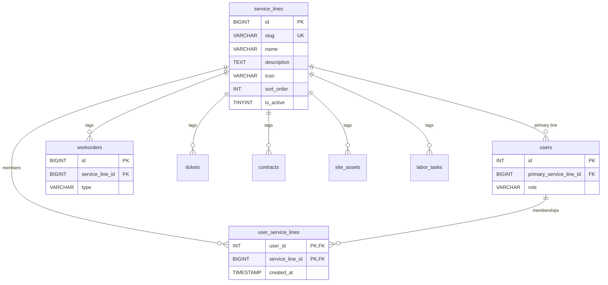

# Phase 11 — Service Line Configurability

**Status:** Implemented 2026-04-25
**Depends on:** Migration 099 (`divisions`); existing `workorders` / `tickets` / `contracts` / `site_assets` / `labor_tasks` / `users` tables.
**Plan references:** [`../woms-expansion-plan.md`](../woms-expansion-plan.md) (Phase 11, items M1/M2/M12); [`../woms-service-lines.md`](../woms-service-lines.md).
**Migration:** [`database/migrations/152_service_lines.sql`](../../database/migrations/152_service_lines.sql).

Phase 11 lays the trade-taxonomy foundation for the WOMS expansion. It introduces a `service_lines` lookup, multi-trade user membership, and a nullable `service_line_id` FK on the five entity tables that downstream phases (12-18) will filter, route, and report against. No URL re-namespacing, per-trade dashboards, or per-slug permissions ship in this phase — those are explicitly deferred. Existing single-shop auto-repair customers see no UI change.

---

## 1. What shipped

- **Trade taxonomy.** `service_lines` lookup table with nine seeded rows (`auto_repair`, `building_repair`, `property_management`, `equipment_repair`, `fleet_management`, `it_support`, `security_systems`, `pos_support`, `commercial_cleaning`).
- **Per-user multi-trade membership.** `user_service_lines` join table plus `users.primary_service_line_id`. Backfill grants `auto_repair` membership + primary to every `admin` / `manager` / `technician`.
- **Service-line tagging on five core entities.** Nullable `service_line_id` FK on `workorders`, `tickets`, `contracts`, `site_assets`, `labor_tasks`. Existing rows backfilled to `auto_repair`.
- **Trade-aware WO type vocabulary.** `workorders.type` column (default `corrective`), validated at the model layer via `App\Models\Workorder::ALLOWED_TYPES` (no DB CHECK constraint — adding a type is a code change, not a migration).
- **Backend service layer.** `App\Models\ServiceLine`, `App\Services\ServiceLine\{ServiceLineRepository, ServiceLineService, ServiceLineController}`.
- **HTTP API surface.** Six new endpoints under `/api/service-lines` and `/api/me/service-lines`; `/api/auth/me` extended with `user.service_lines` and `user.primary_service_line_id`. Route module: [`routes/modules/service_lines.php`](../../routes/modules/service_lines.php), wired in via `routes/api.php`.
- **Permission.** Single new permission `settings.service_lines.manage` (admin only) registered in `App\Support\Auth\RolePermissions`.
- **Frontend client + state.** `src/services/serviceLine.service.js` API client; auth store gains `serviceLines`, `primaryServiceLineId`, `currentServiceLineId`, `currentServiceLine`, `setCurrentServiceLine`; localStorage key `phparm.currentServiceLineId` persists the selection.
- **Sidebar switcher.** `src/react/components/layout/ServiceLineSwitcher.jsx`, mounted in `Sidebar.jsx`. Renders `null` for users with ≤1 service line.
- **Idempotent migration.** Re-running `php migrate.php` is a no-op; every CREATE/ALTER/INSERT is guarded.

---

## 2. Data model

### 2.1 New tables

#### `service_lines`

| Column        | Type               | Null | Default              | Notes                                    |
|---------------|--------------------|------|----------------------|------------------------------------------|
| `id`          | `BIGINT UNSIGNED`  | NO   | AUTO_INCREMENT       | PK                                       |
| `slug`        | `VARCHAR(40)`      | NO   | —                    | UNIQUE; stable external key, never rename |
| `name`        | `VARCHAR(120)`     | NO   | —                    | Display name                             |
| `description` | `TEXT`             | YES  | NULL                 | Positioning blurb                        |
| `icon`        | `VARCHAR(60)`      | YES  | NULL                 | Heroicon-style identifier                |
| `sort_order`  | `INT`              | NO   | 0                    | Asc; ties broken by name                 |
| `is_active`   | `TINYINT(1)`       | NO   | 1                    | Soft-disable without deleting            |
| `created_at`  | `TIMESTAMP`        | NO   | `CURRENT_TIMESTAMP`  |                                          |
| `updated_at`  | `TIMESTAMP`        | NO   | `CURRENT_TIMESTAMP ON UPDATE CURRENT_TIMESTAMP` |               |

Indexes: `idx_service_lines_active (is_active)`, `idx_service_lines_sort (sort_order)`, plus the implicit unique on `slug`.

#### `user_service_lines`

| Column            | Type               | Null | Default              | Notes                                  |
|-------------------|--------------------|------|----------------------|----------------------------------------|
| `user_id`         | `INT UNSIGNED`     | NO   | —                    | FK `users.id` ON DELETE CASCADE        |
| `service_line_id` | `BIGINT UNSIGNED`  | NO   | —                    | FK `service_lines.id` ON DELETE CASCADE |
| `created_at`      | `TIMESTAMP`        | NO   | `CURRENT_TIMESTAMP`  |                                        |

Composite PK `(user_id, service_line_id)`; secondary index `idx_user_service_lines_service_line (service_line_id)` for reverse lookups.

### 2.2 Modified tables (new columns only)

| Table         | New column                  | Type                | Null | Default       | FK target                      | On delete   |
|---------------|-----------------------------|---------------------|------|---------------|--------------------------------|-------------|
| `workorders`  | `service_line_id`           | `BIGINT UNSIGNED`   | YES  | NULL          | `service_lines(id)`            | SET NULL    |
| `workorders`  | `type`                      | `VARCHAR(40)`       | NO   | `'corrective'`| —                              | —           |
| `tickets`     | `service_line_id`           | `BIGINT UNSIGNED`   | YES  | NULL          | `service_lines(id)`            | SET NULL    |
| `contracts`   | `service_line_id`           | `BIGINT UNSIGNED`   | YES  | NULL          | `service_lines(id)`            | SET NULL    |
| `site_assets` | `service_line_id`           | `BIGINT UNSIGNED`   | YES  | NULL          | `service_lines(id)`            | SET NULL    |
| `labor_tasks` | `service_line_id`           | `BIGINT UNSIGNED`   | YES  | NULL          | `service_lines(id)`            | SET NULL    |
| `users`       | `primary_service_line_id`   | `BIGINT UNSIGNED`   | YES  | NULL          | `service_lines(id)`            | SET NULL    |

All four `service_line_id` columns get an `idx_<table>_service_line` index. `workorders.type` gets `idx_workorders_type`. `users.primary_service_line_id` gets `idx_users_primary_service_line`. FK names follow `fk_<table>_service_line` (and `fk_users_primary_service_line`).

### 2.3 ER diagram



### 2.4 `divisions` vs `service_lines` — orthogonal dimensions

These are **separate, coexisting** dimensions. Do not fold them together.

| Dimension       | Shape | Question it answers       | Owns                                    |
|-----------------|-------|---------------------------|-----------------------------------------|
| `divisions`     | Org   | *Who is doing the work?*  | Tenancy, billing, regional reporting    |
| `service_lines` | Trade | *What kind of work is it?* | Workflow vocabulary, dispatch filtering |

A single division (e.g. "North Region Operations") can perform work across multiple service lines; a single service line (e.g. IT Support) can be performed by multiple divisions. The two FKs sit side-by-side on `workorders` / `tickets` / `contracts` / `site_assets` and are queried independently.

---

## 3. API surface

All endpoints are JSON, authenticated via the standard `Middleware::auth()` JWT chain, and follow the project's `{ success, data, message }` envelope. Examples below show the inner `data` payload only.

### 3.1 New endpoints

| Method | Path                                | Permission                       | Purpose                                  |
|--------|-------------------------------------|----------------------------------|------------------------------------------|
| GET    | `/api/service-lines`                | auth                             | List active service lines (full DTOs)    |
| GET    | `/api/service-lines/{id}`           | auth                             | Show one                                 |
| POST   | `/api/service-lines`                | `settings.service_lines.manage`  | Create                                   |
| PUT    | `/api/service-lines/{id}`           | `settings.service_lines.manage`  | Partial update (slug is **not** updatable) |
| GET    | `/api/me/service-lines`             | auth                             | Calling user's effective lines + primary |
| PUT    | `/api/me/service-lines/primary`     | auth                             | Set calling user's primary line          |

`GET /api/service-lines` accepts optional query string `?include_inactive=1` to include disabled rows.

#### `GET /api/service-lines`

```bash
curl -sS -H "Authorization: Bearer $JWT" \
  https://example.test/api/service-lines
```

Response:

```json
{
  "service_lines": [
    {
      "id": 1,
      "slug": "auto_repair",
      "name": "Auto Repair / Roadside / Towing",
      "description": "Independent shops and mobile mechanics ...",
      "icon": "wrench",
      "sort_order": 10,
      "is_active": true,
      "created_at": "2026-04-25 12:00:00",
      "updated_at": "2026-04-25 12:00:00"
    }
  ]
}
```

#### `GET /api/service-lines/{id}`

```bash
curl -sS -H "Authorization: Bearer $JWT" \
  https://example.test/api/service-lines/6
```

Returns `{ "service_line": { ... } }`. 400 if not found (the codebase uses `InvalidArgumentException → 400` for not-found at the HTTP layer; see the in-code note in `ServiceLineController`).

#### `POST /api/service-lines` — admin only

Request body:

```json
{
  "slug": "hvac",
  "name": "HVAC",
  "description": "Heating, ventilation, air conditioning",
  "icon": "fire",
  "sort_order": 100,
  "is_active": true
}
```

```bash
curl -sS -X POST -H "Authorization: Bearer $JWT" \
  -H "Content-Type: application/json" \
  -d '{"slug":"hvac","name":"HVAC","sort_order":100}' \
  https://example.test/api/service-lines
```

Validation:
- `slug` and `name` required.
- `slug` must match `/^[a-z0-9_]+$/`.
- `slug` must be unique (409-equivalent surfaces as 400 with `InvalidArgumentException`).

#### `PUT /api/service-lines/{id}` — admin only

Partial update. Accepts any subset of `name`, `description`, `icon`, `sort_order`, `is_active`. **`slug` is intentionally not updatable** — it is a stable external key, mirroring the `divisions.code` convention. Deprecate-and-add only.

#### `GET /api/me/service-lines`

```bash
curl -sS -H "Authorization: Bearer $JWT" \
  https://example.test/api/me/service-lines
```

Response:

```json
{
  "service_lines": [
    { "id": 1, "slug": "auto_repair", "name": "...", "icon": "wrench", ... },
    { "id": 6, "slug": "it_support", "name": "...", "icon": "cpu",   ... }
  ],
  "primary_id": 1
}
```

The list applies the role-based visibility rules in section 5.

#### `PUT /api/me/service-lines/primary`

Request body:

```json
{ "service_line_id": 6 }
```

```bash
curl -sS -X PUT -H "Authorization: Bearer $JWT" \
  -H "Content-Type: application/json" \
  -d '{"service_line_id":6}' \
  https://example.test/api/me/service-lines/primary
```

Returns the same shape as `GET /api/me/service-lines` reflecting the new primary. For non-admin users, the target line must exist in `user_service_lines` for the calling user; otherwise 400. Admins bypass that membership check (they can set their primary to any active line).

### 3.2 Modified endpoint — `GET /api/auth/me`

The `user` payload now includes two extra fields:

```json
{
  "user": {
    "id": 42,
    "email": "...",
    "role": "technician",
    "service_lines": [
      { "id": 1, "slug": "auto_repair", "name": "Auto Repair / Roadside / Towing", "icon": "wrench" }
    ],
    "primary_service_line_id": 1
  }
}
```

`service_lines` in `/auth/me` is a **trimmed DTO** (id, slug, name, icon only) for sidebar use. The full DTO is available via `GET /api/service-lines`. If the migration has not yet run, the field defaults to `[]` / `null` rather than failing the request — this is intentional (see the catch in `routes/api.php` around line 1293).

---

## 4. Role-based visibility rules

| Role                                        | Effective lines visible                          | Can set primary to                            | Notes |
|---------------------------------------------|--------------------------------------------------|------------------------------------------------|-------|
| `admin`                                     | **All active lines** (membership ignored)        | Any active line                                | Bypass on both read and write paths |
| `manager`                                   | Explicit `user_service_lines` rows; **falls back to all active** if zero memberships | Any line in their effective list   | Division-derived coverage is Phase 12+ |
| `technician`, `parts`, `dispatcher`, `roadside`, `cms`, `cms_editor`, `cms_publisher`, `customer` | Explicit `user_service_lines` rows only — no fallback | Any line in their effective list | Empty list is valid; switcher hides |

Implementation: `App\Services\ServiceLine\ServiceLineService::getEffectiveLinesForUser()` and `setPrimary()`. Constants `UNCONDITIONAL_ACCESS_ROLES` and `FALLBACK_ACCESS_ROLES` capture the matrix above.

Backfill defaults set by migration 152:
- Every `admin`, `manager`, `technician` gets `auto_repair` membership and `primary_service_line_id = auto_repair.id`.
- All other roles get **no** primary line and **no** memberships. Operators must assign deliberately (see runbook).

---

## 5. Frontend integration

### 5.1 Sidebar switcher

- File: [`src/react/components/layout/ServiceLineSwitcher.jsx`](../../src/react/components/layout/ServiceLineSwitcher.jsx).
- Mounted in [`src/react/components/layout/Sidebar.jsx`](../../src/react/components/layout/Sidebar.jsx) immediately above the navigation list and supports the sidebar's collapsed mode.
- **Renders `null` when `serviceLines.length <= 1`.** Single-line auto-repair shops see zero UI change.
- On selection: updates local state synchronously, writes to `localStorage`, then fires `serviceLineService.setPrimary(id)` to sync server-side. Failure surfaces a toast; the local choice is kept.

### 5.2 Auth store fields

In `src/react/stores/auth.jsx` (`useAuthStore`):

| Field                    | Type                       | When it updates                                                                 |
|--------------------------|----------------------------|----------------------------------------------------------------------------------|
| `serviceLines`           | `Array<{id, slug, name, icon}>` | Whenever `user` changes (re-derived from `user.service_lines`)              |
| `primaryServiceLineId`   | `number \| null`           | Whenever `user` changes; also on successful `setCurrentServiceLine` server response |
| `currentServiceLineId`   | `number \| null`           | Initial: `localStorage > user.primary_service_line_id > null`. Updated by `setCurrentServiceLine`. |
| `currentServiceLine`     | `object \| null`           | Memoized `serviceLines.find(l => l.id === currentServiceLineId)`                |
| `setCurrentServiceLine`  | `(id) => Promise<{service_lines, primary_id}>` | Optimistic local + persisted server call          |

### 5.3 localStorage key

```
phparm.currentServiceLineId
```

Stored as a string-encoded integer. Cleared on logout (when `user` becomes `null`, derived state resets but the key is intentionally **not** removed — a re-login restores the prior preference).

### 5.4 Consuming `currentServiceLineId` in a Phase 12+ view

Phase 11 exposes the context but does **not** filter any lists by it. To consume in a new view:

```javascript
import { useAuthStore } from '../../stores/auth'

function MyView() {
  const { currentServiceLineId, currentServiceLine } = useAuthStore()

  // Pass to API filter:
  const { data } = useSWR(
    currentServiceLineId
      ? `/api/workorders?service_line_id=${currentServiceLineId}`
      : '/api/workorders'
  )

  // Or branch UI per slug:
  if (currentServiceLine?.slug === 'it_support') {
    return <ITHelpdeskBoard />
  }
  return <DefaultBoard />
}
```

Note: the `service_line_id` query parameter on existing list endpoints is **not** wired up yet (Phase 17). Backend filtering is also Phase 17.

---

## 6. Operator runbook

### 6.1 Verify the migration ran

```sql
-- Table exists:
SHOW CREATE TABLE service_lines\G

-- Nine seeded rows:
SELECT COUNT(*) FROM service_lines;          -- expect 9
SELECT id, slug, name, sort_order, is_active FROM service_lines ORDER BY sort_order;

-- Backfill landed:
SELECT COUNT(*) FROM workorders WHERE service_line_id IS NULL;  -- expect 0
SELECT COUNT(*) FROM users
 WHERE primary_service_line_id IS NULL
   AND role IN ('admin','manager','technician');                -- expect 0
```

### 6.2 Add a new service line

Two equivalent paths.

**Via API** (preferred — runs validation):

```bash
curl -sS -X POST -H "Authorization: Bearer $ADMIN_JWT" \
  -H "Content-Type: application/json" \
  -d '{"slug":"hvac","name":"HVAC","icon":"fire","sort_order":100}' \
  https://example.test/api/service-lines
```

**Via SQL** (when the API is unavailable, e.g. during install scripts):

```sql
INSERT INTO service_lines (slug, name, icon, sort_order, is_active)
VALUES ('hvac', 'HVAC', 'fire', 100, 1);
```

Slugs are stable identifiers — never `UPDATE` a slug in place. To rename, mark old `is_active=0`, insert new, migrate FK references manually.

### 6.3 Assign a user to additional service lines

**There is no admin UI for membership management in Phase 11.** This is a documented gap (see section 8). Until a UI ships, use SQL:

```sql
-- Grant membership in 'it_support' to user 42:
INSERT IGNORE INTO user_service_lines (user_id, service_line_id)
SELECT 42, id FROM service_lines WHERE slug = 'it_support';

-- Revoke membership:
DELETE FROM user_service_lines
 WHERE user_id = 42
   AND service_line_id = (SELECT id FROM service_lines WHERE slug = 'it_support');
```

Revoking the user's current primary clears `users.primary_service_line_id` automatically (see `ServiceLineRepository::unassignUser`); doing the DELETE directly via SQL skips that, so manually `UPDATE users SET primary_service_line_id = NULL WHERE id = 42 AND primary_service_line_id = <revoked id>` if needed.

### 6.4 Set or change a user's primary line

**Self-service (the user's own primary)** — preferred:

```bash
curl -sS -X PUT -H "Authorization: Bearer $JWT" \
  -H "Content-Type: application/json" \
  -d '{"service_line_id": 6}' \
  https://example.test/api/me/service-lines/primary
```

**Admin override** (set someone else's primary): no API endpoint in Phase 11. SQL:

```sql
-- Make sure the user has membership first (admins are exempt from this):
INSERT IGNORE INTO user_service_lines (user_id, service_line_id) VALUES (42, 6);

UPDATE users SET primary_service_line_id = 6 WHERE id = 42;
```

### 6.5 Rollback (manual, deliberately not auto-rollback)

The migration header documents the inverse. Run in this order:

```sql
-- 1. Drop FKs
ALTER TABLE workorders   DROP FOREIGN KEY fk_workorders_service_line;
ALTER TABLE tickets      DROP FOREIGN KEY fk_tickets_service_line;
ALTER TABLE contracts    DROP FOREIGN KEY fk_contracts_service_line;
ALTER TABLE site_assets  DROP FOREIGN KEY fk_site_assets_service_line;
ALTER TABLE labor_tasks  DROP FOREIGN KEY fk_labor_tasks_service_line;
ALTER TABLE users        DROP FOREIGN KEY fk_users_primary_service_line;

-- 2. Drop indexes
ALTER TABLE workorders   DROP INDEX idx_workorders_service_line;
ALTER TABLE workorders   DROP INDEX idx_workorders_type;
ALTER TABLE tickets      DROP INDEX idx_tickets_service_line;
ALTER TABLE contracts    DROP INDEX idx_contracts_service_line;
ALTER TABLE site_assets  DROP INDEX idx_site_assets_service_line;
ALTER TABLE labor_tasks  DROP INDEX idx_labor_tasks_service_line;
ALTER TABLE users        DROP INDEX idx_users_primary_service_line;

-- 3. Drop columns
ALTER TABLE workorders   DROP COLUMN service_line_id, DROP COLUMN type;
ALTER TABLE tickets      DROP COLUMN service_line_id;
ALTER TABLE contracts    DROP COLUMN service_line_id;
ALTER TABLE site_assets  DROP COLUMN service_line_id;
ALTER TABLE labor_tasks  DROP COLUMN service_line_id;
ALTER TABLE users        DROP COLUMN primary_service_line_id;

-- 4. Drop join table, then lookup
DROP TABLE user_service_lines;
DROP TABLE service_lines;
```

Application code references to `service_line_id` and `Workorder::TYPE_*` will then throw on read; revert the matching commit before doing this in production.

---

## 7. Known gaps & next phases

Scoped out of Phase 11 by design. Each item is owned by a specific later phase:

| Deferred capability | Picked up in |
|---|---|
| Per-trade dashboards and KPI widgets | Phase 17 (Should S10) |
| URL re-namespacing under `/cp/<service-line>/...` | Phase 17 |
| Admin UI for managing user-to-service-line memberships | Phase 17 |
| Backend list filtering (WO/ticket/asset) by `currentServiceLineId` | Phase 17 |
| UI surfaces for the seven new WO types (`preventive`, `inspection`, `install`, `project`, `recurring_visit`, `change_request`) — accepted at the model layer today but no creation/edit forms expose them | Per-trade phases 12-16 + Phase 17 |
| Per-slug permissions (`service_line.it_support.view`, etc.) | Each per-trade phase 12-16 |
| Trade-aware labor-task library UI | Phase 17 (Must M12) |
| Subcontractor service-line tagging | Per-trade phases 12-16 |
| `service_lines.parent_id` for sub-trades (HVAC/plumbing/electrical under building_repair) | Phase 12 if needed; not committed |

---

## 8. Open questions / future work

The seven open questions raised in [`woms-expansion-plan.md`](../woms-expansion-plan.md) §"Open questions to resolve before Phase 11 starts" were tracked through implementation. Status as of close-out:

| # | Question | Resolved in Phase 11? | Disposition |
|---|---|---|---|
| 1 | Service-line taxonomy — exact slugs and names | ✅ | Nine slugs locked in migration 152 seed; treat as stable external keys |
| 2 | Backfill scope — default everything to `auto_repair` vs survey existing customers | ✅ | Migration backfills all existing rows + admin/manager/technician users to `auto_repair`; survey work deferred to ops, no code path |
| 3 | Pricing model per vertical (drives `contracts.billing_model` enum) | ❌ | Out of scope for Phase 11 — `contracts.billing_model` not added yet; assigned to Phase 13 (Lease & Lifecycle) |
| 4 | Branding — shared vs distinct customer experience | ❌ | Product decision, not engineering; no Phase 11 code dependency |
| 5 | Mobile app vs PWA for WOMS field experience | ❌ | Forcing function is Phase 15 (Recurring Service Routes); revisit then |
| 6 | Integration priorities (accounting / RMM / telematics first-class vendors) | ❌ | Per-vertical phase decision (Phase 14 IT, Phase 16 POS); no Phase 11 impact |
| 7 | Compliance scope (SOC 2 Type II, HIPAA, etc.) for security/IT | ❌ | Open; revisit before Phase 14 IT Support kickoff |

Engineering decisions ratified during Phase 11 implementation (not in the original open-questions list):

| Decision | Status |
|---|---|
| `service_lines` is a separate dimension from `divisions` (do not merge) | ✅ Documented in migration header + section 2.4 above |
| `workorders.type` defaults to `corrective` for legacy rows | ✅ Schema default + model default |
| Multi-trade membership via join table, not via expanding the role enum | ✅ `user_service_lines` |
| WO type validation in PHP (`Workorder::ALLOWED_TYPES`) rather than DB CHECK constraint | ✅ Adding new types is a code change, not a migration |
| Sidebar switcher is minimal in Phase 11 — exposes context, does not filter lists | ✅ Downstream phases consume `currentServiceLineId` |
| Only `settings.service_lines.manage` permission registered now; per-slug perms deferred | ✅ Each per-trade phase owns its own perms |
| `/api/auth/me` degrades gracefully if migration not yet applied | ✅ Try/catch returns `[] / null` rather than 500 |

---

## Files of record

- Migration: `database/migrations/152_service_lines.sql`
- Backend: `src/Models/ServiceLine.php`, `src/Services/ServiceLine/`
- Routes: `routes/modules/service_lines.php` (registered in `routes/api.php`)
- `/auth/me` extension: `routes/api.php` (around lines 1277-1298)
- Permission: `src/Support/Auth/RolePermissions.php` (`settings.service_lines.manage`)
- Model updates: `src/Models/Workorder.php` (TYPE constants), `src/Models/LaborTask.php`, `src/Services/Workorder/WorkorderRepository.php`, `src/Services/TimeTracking/LaborTaskService.php`
- Frontend client: `src/services/serviceLine.service.js`
- Frontend store: `src/react/stores/auth.jsx`
- Sidebar UI: `src/react/components/layout/ServiceLineSwitcher.jsx`, `src/react/components/layout/Sidebar.jsx`
