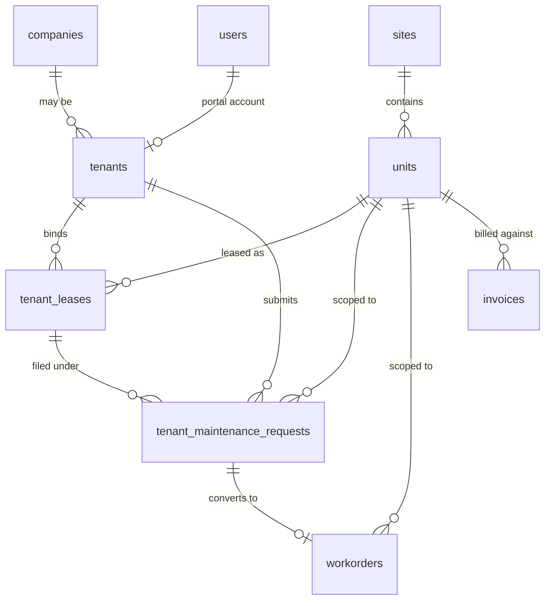

# Phase 12 — Property Management Vertical

**Status:** Implemented 2026-04-30
**Depends on:** Phase 11 (`service_lines`); existing `sites`, `companies`, `users`, `workorders`, `invoices` tables.
**Plan reference:** [`../woms-expansion-plan.md`](../woms-expansion-plan.md) (Phase 12, item M6).
**Migrations:**
[`157_property_management_tenants_units_leases.sql`](../../database/migrations/157_property_management_tenants_units_leases.sql) ·
[`158_invoices_unit_and_tenant_billable_party.sql`](../../database/migrations/158_invoices_unit_and_tenant_billable_party.sql) ·
[`159_tenant_maintenance_requests.sql`](../../database/migrations/159_tenant_maintenance_requests.sql)

Phase 12 introduces the property-management vertical: leasable spaces inside a site (`units`), the lessees occupying them (`tenants`), the lease terms binding them (`tenant_leases`), and the tenant-side intake doc that becomes a workorder (`tenant_maintenance_requests`). Workorders gain a nullable `unit_id` plus a `tenant_billable_party` snapshot so the WO→invoice routing decision is captured at conversion time and never silently re-routes if the lease later changes. Non-property-mgmt customers see no behavioural change — every new column is NULL by default.

---

## 1. What shipped

- **Three new domain tables.** `units` (leasable spaces under a `sites` row), `tenants` (lessees, individual or business), and `tenant_leases` (the join carrying lease terms and the all-important `billing_responsibility` field).
- **Tenant-side intake table.** `tenant_maintenance_requests` — the inbox a tenant submits when something in their unit needs attention. Deliberately separate from `estimate_requests` (which is auth-less + reCAPTCHA-gated and shaped for vehicles).
- **Workorder routing columns.** `workorders.unit_id` (nullable FK → `units.id`) and `workorders.tenant_billable_party` (nullable enum: `landlord` | `tenant` | `split`). The latter is a snapshot, not a live lookup.
- **Invoice carry-through.** `invoices.unit_id` and `invoices.tenant_billable_party` mirror the WO-side columns so a paid invoice retains its routing decision after the source lease ends.
- **`TenantBillingResolver`.** Pure resolver that consumes `tenant_leases.billing_responsibility` and the per-category `maintenance_terms` JSON map to decide whose invoice a WO becomes. Default fall-through is `landlord` — matches standard commercial-lease practice.
- **Dual-surface controllers.** `TenantMaintenanceRequestController` exposes the same logic over a tenant-portal slice (gated by `Tenant.portal_user_id`) and a staff-queue slice (gated by `property.units.manage`).
- **Permissions.** Three new permission slugs — `property.units.{view,manage}`, `property.tenants.{view,manage}`, `property.leases.{view,manage}` — enforced inside each controller (mirrors `ServiceLineController`).
- **HTTP API.** 21 endpoints under `/api/units`, `/api/tenants`, `/api/tenant-leases`, `/api/tenant/*` (tenant portal), and `/api/maintenance-requests` (staff queue). Wired via [`routes/modules/property_management.php`](../../routes/modules/property_management.php).
- **Tenant portal UI.** Three React views — `views/tenant/MyUnits.jsx`, `views/tenant/MyRequests.jsx`, `views/tenant/NewRequest.jsx` — mounted under the dedicated `/tenant` shell with its own sidebar (`tenantMenuItems` in `Sidebar.jsx`).
- **Staff config UI.** `views/settings/PropertyManagement.jsx` mounted at `/cp/settings/property-management` for unit / tenant / lease CRUD.
- **Idempotent migrations.** All three migrations re-run to no-ops; every CREATE/ALTER is guarded by `IF NOT EXISTS` or information_schema checks.

---

## 2. Data model

### 2.1 New tables

#### `units`

| Column         | Type               | Null | Default              | Notes                                    |
|----------------|--------------------|------|----------------------|------------------------------------------|
| `id`           | `BIGINT UNSIGNED`  | NO   | AUTO_INCREMENT       | PK                                       |
| `site_id`      | `INT UNSIGNED`     | NO   | —                    | FK `sites.id` ON DELETE CASCADE          |
| `code`         | `VARCHAR(40)`      | NO   | —                    | Site-scoped identifier (e.g., `200`, `3B`) |
| `name`         | `VARCHAR(120)`     | YES  | NULL                 | Optional display name                    |
| `unit_type`    | `VARCHAR(40)`      | NO   | `'commercial'`       | Free-form: `commercial`, `residential`, `storage`, `parking`, … |
| `floor`        | `VARCHAR(20)`      | YES  | NULL                 |                                          |
| `square_feet`  | `INT UNSIGNED`     | YES  | NULL                 |                                          |
| `bedrooms`     | `TINYINT UNSIGNED` | YES  | NULL                 | Residential                              |
| `bathrooms`    | `DECIMAL(3,1)`     | YES  | NULL                 | Residential                              |
| `status`       | `VARCHAR(30)`      | NO   | `'active'`           | `active` / `vacant` / `inactive` (app-validated) |
| `notes`        | `TEXT`             | YES  | NULL                 |                                          |
| `created_at`   | `TIMESTAMP`        | NO   | `CURRENT_TIMESTAMP`  |                                          |
| `updated_at`   | `TIMESTAMP`        | NO   | `CURRENT_TIMESTAMP ON UPDATE CURRENT_TIMESTAMP` |               |

Unique key `uq_units_site_code (site_id, code)` — code is unique within a site, not globally. Indexes: `idx_units_site`, `idx_units_status`, `idx_units_type`.

#### `tenants`

| Column            | Type               | Null | Default              | Notes                                  |
|-------------------|--------------------|------|----------------------|----------------------------------------|
| `id`              | `BIGINT UNSIGNED`  | NO   | AUTO_INCREMENT       | PK                                     |
| `company_id`      | `INT UNSIGNED`     | YES  | NULL                 | FK `companies.id` ON DELETE SET NULL — set when the tenant is itself a customer company we already track |
| `portal_user_id`  | `INT UNSIGNED`     | YES  | NULL                 | FK `users.id` ON DELETE SET NULL — link to the portal account; gates tenant self-service surface |
| `entity_type`     | `VARCHAR(20)`      | NO   | `'individual'`       | `individual` / `business`              |
| `display_name`    | `VARCHAR(191)`     | NO   | —                    | Identity for individual tenants        |
| `primary_email`   | `VARCHAR(160)`     | YES  | NULL                 |                                        |
| `primary_phone`   | `VARCHAR(40)`      | YES  | NULL                 |                                        |
| `secondary_phone` | `VARCHAR(40)`      | YES  | NULL                 |                                        |
| `status`          | `VARCHAR(30)`      | NO   | `'active'`           | `active` / `archived`                  |
| `move_in_date`    | `DATE`             | YES  | NULL                 |                                        |
| `notes`           | `TEXT`             | YES  | NULL                 |                                        |
| `created_at`      | `TIMESTAMP`        | NO   | `CURRENT_TIMESTAMP`  |                                        |
| `updated_at`      | `TIMESTAMP`        | NO   | `CURRENT_TIMESTAMP ON UPDATE CURRENT_TIMESTAMP` |             |

Indexes: `idx_tenants_company`, `idx_tenants_portal_user`, `idx_tenants_status`, `idx_tenants_email`.

`portal_user_id` is the only thing that grants tenant-portal access — there is no tenant-specific role. Setting it links the existing JWT user to the tenant identity; clearing it locks the tenant out without deleting the row.

#### `tenant_leases`

| Column                   | Type               | Null | Default              | Notes                                 |
|--------------------------|--------------------|------|----------------------|---------------------------------------|
| `id`                     | `BIGINT UNSIGNED`  | NO   | AUTO_INCREMENT       | PK                                    |
| `tenant_id`              | `BIGINT UNSIGNED`  | NO   | —                    | FK `tenants.id` ON DELETE CASCADE     |
| `unit_id`                | `BIGINT UNSIGNED`  | NO   | —                    | FK `units.id` ON DELETE CASCADE       |
| `start_date`             | `DATE`             | NO   | —                    |                                       |
| `end_date`               | `DATE`             | YES  | NULL                 | NULL = month-to-month / open-ended    |
| `monthly_rent`           | `DECIMAL(12,2)`    | YES  | NULL                 |                                       |
| `deposit_amount`         | `DECIMAL(12,2)`    | YES  | NULL                 |                                       |
| `billing_responsibility` | `VARCHAR(20)`      | NO   | `'landlord'`         | `landlord` / `tenant` / `split` (app-validated) |
| `maintenance_terms`      | `JSON`             | YES  | NULL                 | Per-category billing rules — consulted only when `billing_responsibility = 'split'` |
| `status`                 | `VARCHAR(30)`      | NO   | `'active'`           | `active` / `expired` / `terminated`   |
| `terms`                  | `TEXT`             | YES  | NULL                 | Free-form lease body                  |
| `notes`                  | `TEXT`             | YES  | NULL                 |                                       |
| `created_at`             | `TIMESTAMP`        | NO   | `CURRENT_TIMESTAMP`  |                                       |
| `updated_at`             | `TIMESTAMP`        | NO   | `CURRENT_TIMESTAMP ON UPDATE CURRENT_TIMESTAMP` |            |

Indexes: `idx_tenant_leases_tenant`, `idx_tenant_leases_unit`, `idx_tenant_leases_status`, `idx_tenant_leases_dates (start_date, end_date)`.

`maintenance_terms` shape (example): `{"plumbing":"landlord","fixtures":"tenant","appliance":"tenant"}`. Categories not present in the map fall through to `landlord` — same as standard commercial-lease boilerplate. The vocabulary is deliberately uncon­strained at the DB layer so categories can be added without migrations.

#### `tenant_maintenance_requests`

| Column             | Type               | Null | Default              | Notes                                   |
|--------------------|--------------------|------|----------------------|-----------------------------------------|
| `id`               | `BIGINT UNSIGNED`  | NO   | AUTO_INCREMENT       | PK                                      |
| `tenant_id`        | `BIGINT UNSIGNED`  | NO   | —                    | FK `tenants.id` ON DELETE CASCADE       |
| `unit_id`          | `BIGINT UNSIGNED`  | NO   | —                    | FK `units.id` ON DELETE CASCADE         |
| `tenant_lease_id`  | `BIGINT UNSIGNED`  | YES  | NULL                 | FK `tenant_leases.id` ON DELETE SET NULL — snapshot of which lease the request was filed under |
| `category`         | `VARCHAR(50)`      | YES  | NULL                 | Free-form (`plumbing`, `hvac`, `appliance`, `pest`, …) — consumed by `TenantBillingResolver` for split leases |
| `priority`         | `VARCHAR(20)`      | NO   | `'normal'`           | `low` / `normal` / `high` / `emergency` |
| `status`           | `VARCHAR(20)`      | NO   | `'pending'`          | See lifecycle below                     |
| `title`            | `VARCHAR(255)`     | NO   | —                    |                                         |
| `description`      | `TEXT`             | YES  | NULL                 |                                         |
| `workorder_id`     | `INT UNSIGNED`     | YES  | NULL                 | FK `workorders.id` ON DELETE SET NULL — set when status flips to `converted`. INT (not BIGINT) because legacy workorder PK |
| `triaged_at`       | `DATETIME`         | YES  | NULL                 |                                         |
| `triaged_by`       | `BIGINT UNSIGNED`  | YES  | NULL                 | Staff `users.id`                        |
| `converted_at`     | `DATETIME`         | YES  | NULL                 |                                         |
| `converted_by`     | `BIGINT UNSIGNED`  | YES  | NULL                 | Staff `users.id`                        |
| `declined_reason`  | `VARCHAR(255)`     | YES  | NULL                 |                                         |
| `created_at`       | `DATETIME`         | NO   | `CURRENT_TIMESTAMP`  |                                         |
| `updated_at`       | `DATETIME`         | NO   | `CURRENT_TIMESTAMP ON UPDATE CURRENT_TIMESTAMP` |              |

Indexes: `idx_tmr_tenant`, `idx_tmr_unit`, `idx_tmr_status`, `idx_tmr_workorder`.

**Lifecycle:**

```
pending  ──triage──►  triaged  ──convert──►  converted   (terminal)
   │                     │
   │                     └──decline──►  declined         (terminal)
   │
   └──cancel──────────────────────────►  cancelled       (terminal — tenant-driven only)
```

### 2.2 Modified tables (new columns only)

| Table        | New column                | Type                | Null | Default | FK target              | On delete |
|--------------|---------------------------|---------------------|------|---------|------------------------|-----------|
| `workorders` | `unit_id`                 | `BIGINT UNSIGNED`   | YES  | NULL    | `units(id)`            | SET NULL  |
| `workorders` | `tenant_billable_party`   | `VARCHAR(20)`       | YES  | NULL    | —                      | —         |
| `invoices`   | `unit_id`                 | `BIGINT UNSIGNED`   | YES  | NULL    | `units(id)`            | SET NULL  |
| `invoices`   | `tenant_billable_party`   | `VARCHAR(20)`       | YES  | NULL    | —                      | —         |

Indexes added: `idx_workorders_unit`, `idx_workorders_tenant_billable`, `idx_invoices_unit`, `idx_invoices_tenant_billable`.

`workorders.unit_id` is added `AFTER service_line_id` (Phase 11), and `tenant_billable_party` is added `AFTER unit_id` so the property-mgmt block sits as one contiguous group of columns. `invoices.unit_id` is added `AFTER workorder_id` to keep the snapshot adjacent to the source-of-truth FK and avoid a hard ordering dependency on migration 154 (which adds `invoices.service_line_id`).

### 2.3 ER diagram



---

## 3. API surface

All endpoints sit under `Middleware::auth()`; the staff resources additionally enforce `property.*` permissions inside each controller method. The tenant-portal endpoints (`/api/tenant/*`) have **no** role gate — being linked via `tenants.portal_user_id` is the gate.

### 3.1 Units · `/api/units`

| Method | Path                  | Permission              | Purpose                                |
|--------|-----------------------|-------------------------|----------------------------------------|
| GET    | `/api/units`          | `property.units.view`   | List w/ filters: `site_id`, `status`, `unit_type`, `search`; paginated |
| GET    | `/api/units/{id}`     | `property.units.view`   | Single unit                            |
| POST   | `/api/units`          | `property.units.manage` | Body: `site_id`, `code` (required), `name`, `unit_type`, `floor`, `square_feet`, `bedrooms`, `bathrooms`, `status`, `notes` |
| PUT    | `/api/units/{id}`     | `property.units.manage` | Partial update                         |
| DELETE | `/api/units/{id}`     | `property.units.manage` | Hard delete (FK CASCADE drops dependent leases) |

### 3.2 Tenants · `/api/tenants`

| Method | Path                  | Permission                  | Purpose                            |
|--------|-----------------------|-----------------------------|------------------------------------|
| GET    | `/api/tenants`        | `property.tenants.view`     | List; filters: `status`, `company_id`, `search` |
| GET    | `/api/tenants/{id}`   | `property.tenants.view`     | Single tenant                      |
| POST   | `/api/tenants`        | `property.tenants.manage`   | Body: `display_name` (required), `entity_type`, `primary_email`, `primary_phone`, `secondary_phone`, `company_id`, `portal_user_id`, `move_in_date`, `notes`, `status` |
| PUT    | `/api/tenants/{id}`   | `property.tenants.manage`   | Partial update; setting `portal_user_id` grants portal access |

No DELETE — tenants are soft-archived via `status = 'archived'` so historical leases / requests retain their FK target.

### 3.3 Leases · `/api/tenant-leases`

| Method | Path                          | Permission                | Purpose                       |
|--------|-------------------------------|---------------------------|-------------------------------|
| GET    | `/api/tenant-leases`          | `property.leases.view`    | List; filters: `tenant_id`, `unit_id`, `status`, `active_on=YYYY-MM-DD` |
| GET    | `/api/tenant-leases/{id}`     | `property.leases.view`    | Single lease                  |
| POST   | `/api/tenant-leases`          | `property.leases.manage`  | Body: `tenant_id`, `unit_id`, `start_date` (required), `end_date`, `monthly_rent`, `deposit_amount`, `billing_responsibility`, `maintenance_terms` (object), `terms`, `notes`, `status` |
| PUT    | `/api/tenant-leases/{id}`     | `property.leases.manage`  | Partial update                |

`active_on` is the workhorse query — `findActiveForUnit($unitId, $date)` returns the single lease where `start_date ≤ date ≤ end_date OR end_date IS NULL`. The repository takes a unit lock at insert time so two overlapping active leases cannot be created in a race.

### 3.4 Tenant portal · `/api/tenant/*`

| Method | Path                                        | Gate                  | Purpose                                                                  |
|--------|---------------------------------------------|-----------------------|--------------------------------------------------------------------------|
| GET    | `/api/tenant/me`                            | linked tenant         | Returns `{tenant, units}` — units are leases active TODAY for the user  |
| GET    | `/api/tenant/maintenance-requests`          | linked tenant         | Tenant's own requests, paginated                                         |
| POST   | `/api/tenant/maintenance-requests`          | linked tenant         | Body: `unit_id`, `title`, `description`, `category`, `priority` — server validates the tenant has an active lease on the unit |
| POST   | `/api/tenant/maintenance-requests/{id}/cancel` | linked tenant      | Tenant withdraws their own request (only legal from `pending` / `triaged`) |

If the JWT user has no `tenants.portal_user_id` row pointing at them, every `/api/tenant/*` endpoint returns `400` with `"No tenant profile is linked to this account."` This is intentionally not a `403` — it's not a permission denial, it's a missing identity link.

### 3.5 Staff queue · `/api/maintenance-requests`

| Method | Path                                                  | Permission              | Purpose                                                              |
|--------|-------------------------------------------------------|-------------------------|----------------------------------------------------------------------|
| GET    | `/api/maintenance-requests`                           | `property.units.view`   | Queue view; filters: `status`, `unit_id`, `tenant_id`               |
| POST   | `/api/maintenance-requests/{id}/triage`               | `property.units.manage` | `pending → triaged`; stamps `triaged_at` / `triaged_by`              |
| POST   | `/api/maintenance-requests/{id}/decline`              | `property.units.manage` | Body: `reason`. Sets terminal `declined` state                       |
| POST   | `/api/maintenance-requests/{id}/convert-to-workorder` | `property.units.manage` | Body: `branch_id`. Atomic — see §4 below                              |

The staff queue intentionally piggy-backs on `property.units.{view,manage}` rather than introducing a `property.maintenance_requests.*` slug. Operationally it's the same job role (the property manager who looks after units triages their requests), and the perm vocabulary stays small.

---

## 4. Workorder conversion: the snapshot rule

The single most load-bearing decision in this phase is that `workorders.tenant_billable_party` (and the matching column on `invoices`) is **a snapshot taken at conversion time, never a live lookup**.

Sequence inside `convertToWorkorder`:

1. Re-resolve the unit's currently-active lease (not the lease the request was filed under — staff might have updated the lease since intake, and the WO should reflect today's state).
2. Call `TenantBillingResolver::resolveForLease($lease, $request->category)` to compute `landlord` / `tenant` / split-decision.
3. Open a transaction. INSERT into `workorders` with `unit_id`, `tenant_billable_party`, the customer being `tenant.company_id` (the property mgmt firm in landlord mode, or the tenant's own business in tenant-billed mode), and a `WO-REQ-<requestId>` number.
4. Stamp `tenant_maintenance_requests.workorder_id`, `converted_at`, `converted_by`. Status flips to `converted` (terminal).
5. Commit. Return `{request, workorder_id, workorder_number, tenant_billable_party}`.

**Why snapshot, not live lookup?** A lease change in month 4 (e.g., landlord agrees to a deferred-maintenance carve-out for the next renewal) must not retroactively re-route already-converted WOs into the wrong invoice. Once the WO exists, its billing party is decided. Any later revision is a new WO, not an edit.

**Why reject conversion when `tenant.company_id IS NULL`?** Workorders need a `customer_id`. We've got two billable parties (landlord vs tenant), and both eventually resolve to a `companies` row — landlord via the unit→site→company chain, tenant via `tenants.company_id`. If the tenant has no company association, we have no invoiceable identity for the tenant-billed path; rather than guess, we stop at intake and force the operator to either link the tenant to a company or decline the request.

**Default in absence of an active lease.** If the unit has no active lease at WO-creation time (vacant unit getting prep work), `TenantBillingResolver` returns NULL, and the WO carries NULL in `tenant_billable_party` — distinguishable from "explicitly billed to landlord" (the value `'landlord'`). Downstream invoicing treats NULL as "use the existing customer FK" — preserves legacy behaviour.

---

## 5. Frontend integration

### 5.1 Routes

Two route groups in `src/react/router/index.jsx`:

```text
# tenant portal — its own shell, sidebar, and protected wrapper
/tenant                               TenantMyUnits
/tenant/requests                      TenantMyRequests
/tenant/requests/new                  TenantNewRequest

# staff config — settings shell
/cp/settings/property-management      PropertyManagement
```

The tenant routes are pulled out of `protectedRoutes` and re-wrapped under a separate `/tenant` outlet so the tenant-portal shell can render its own sidebar (`tenantMenuItems`) and keep staff nav out of the tenant's view.

### 5.2 Sidebar

`src/react/components/layout/Sidebar.jsx` adds:

```jsx
const tenantMenuItems = [
  { path: '/tenant',          label: 'My Units',             icon: HomeIcon },
  { path: '/tenant/requests', label: 'Maintenance Requests', icon: ClipboardDocumentListIcon },
  { path: '/tenant/requests/new', label: 'New Request',      icon: ClipboardDocumentCheckIcon },
]
```

The sidebar's type switch (`type === 'tenant'`) returns `tenantMenuItems` instead of the staff menu. Staff users do not see the tenant menu and tenants do not see the staff menu — the two surfaces don't bleed into each other.

### 5.3 Unit picker on intake

`POST /api/tenant/maintenance-requests` requires a `unit_id`. The `NewRequest.jsx` form pulls the candidate set from `/api/tenant/me` — only units the tenant has an active lease on today. Server re-validates on submit (`findActiveForUnit` + tenant_id match) so a stale picker can't be exploited to file requests against units the tenant doesn't lease.

---

## 6. Operator runbook

### 6.1 Apply migrations

```bash
php migrate.php
# Verifies 157 → 158 → 159 in sequence. Re-running is a no-op.
```

Post-migrate sanity check:

```sql
SELECT TABLE_NAME FROM information_schema.tables
 WHERE TABLE_SCHEMA = DATABASE()
   AND TABLE_NAME IN ('units','tenants','tenant_leases','tenant_maintenance_requests');
-- expect 4 rows

SELECT COLUMN_NAME FROM information_schema.columns
 WHERE TABLE_SCHEMA = DATABASE() AND TABLE_NAME = 'workorders'
   AND COLUMN_NAME IN ('unit_id','tenant_billable_party');
-- expect 2 rows

SELECT COLUMN_NAME FROM information_schema.columns
 WHERE TABLE_SCHEMA = DATABASE() AND TABLE_NAME = 'invoices'
   AND COLUMN_NAME IN ('unit_id','tenant_billable_party');
-- expect 2 rows
```

### 6.2 Bootstrapping a property-mgmt customer

1. Confirm the customer exists in `companies` with `service_line_id = (SELECT id FROM service_lines WHERE slug = 'property_management')` (Phase 11 tagging).
2. Create the customer's site(s): existing `/api/sites` flow.
3. For each leasable space: `POST /api/units` with `site_id`, unique `code`, `unit_type`.
4. For each lessee: `POST /api/tenants`. If they should self-serve, create a `users` row first (admin `/api/users` flow) and pass the new `users.id` as `portal_user_id`.
5. Tie them together: `POST /api/tenant-leases` with `start_date`, `billing_responsibility`. For split leases, supply `maintenance_terms` like `{"plumbing":"landlord","fixtures":"tenant"}`.
6. Smoke-test the tenant portal: log in as the `portal_user_id`, hit `/tenant`, confirm the leased units appear, file a test request, confirm it surfaces in `/api/maintenance-requests` for staff.

### 6.3 Triage → workorder

Staff queue at `GET /api/maintenance-requests?status=pending` → for each:

- `POST /api/maintenance-requests/{id}/triage` (acknowledges receipt; `pending → triaged`)
- Either:
  - `POST /api/maintenance-requests/{id}/convert-to-workorder` body `{"branch_id":<id>}` — creates the WO with the snapshotted billing party, returns the new WO number; OR
  - `POST /api/maintenance-requests/{id}/decline` body `{"reason":"…"}` — terminal.

The tenant cancels via `POST /api/tenant/maintenance-requests/{id}/cancel` (only valid before `converted` / `declined`).

### 6.4 Verifying a billing snapshot

```sql
-- For a converted request, the WO's tenant_billable_party should match
-- whatever resolveForLease would return for the unit's lease today.
SELECT
    r.id           AS request_id,
    r.category,
    w.id           AS workorder_id,
    w.tenant_billable_party AS wo_snapshot,
    l.billing_responsibility AS current_lease_setting,
    l.maintenance_terms
  FROM tenant_maintenance_requests r
  JOIN workorders w     ON w.id = r.workorder_id
  LEFT JOIN tenant_leases l
       ON l.unit_id = r.unit_id
      AND l.status = 'active'
      AND l.start_date <= CURDATE()
      AND (l.end_date IS NULL OR l.end_date >= CURDATE())
 WHERE r.status = 'converted'
 ORDER BY r.id DESC
 LIMIT 20;
```

Divergence between `wo_snapshot` and `current_lease_setting` is **not** a bug — it just means the lease was edited after conversion. That's the snapshot rule working as designed.

### 6.5 Rollback per migration (manual; not auto-rolled in production)

**Migration 159 (`tenant_maintenance_requests`):**
```sql
DROP TABLE tenant_maintenance_requests;
```

**Migration 158 (`invoices` columns):**
```sql
ALTER TABLE invoices DROP FOREIGN KEY fk_invoices_unit;
ALTER TABLE invoices DROP INDEX idx_invoices_unit;
ALTER TABLE invoices DROP INDEX idx_invoices_tenant_billable;
ALTER TABLE invoices DROP COLUMN unit_id;
ALTER TABLE invoices DROP COLUMN tenant_billable_party;
```

**Migration 157 (`units`/`tenants`/`tenant_leases` + workorders columns):**
```sql
ALTER TABLE workorders DROP FOREIGN KEY fk_workorders_unit;
ALTER TABLE workorders DROP INDEX idx_workorders_unit;
ALTER TABLE workorders DROP INDEX idx_workorders_tenant_billable;
ALTER TABLE workorders DROP COLUMN unit_id;
ALTER TABLE workorders DROP COLUMN tenant_billable_party;
DROP TABLE tenant_leases;
DROP TABLE tenants;
DROP TABLE units;
```

Run in 159 → 158 → 157 order to respect FK direction.

---

## 7. Known gaps

- **Tenant cannot upload a photo** with the request — there is no attachment surface on `tenant_maintenance_requests`. Use the `PortalUploadStorage` pattern from Phase 6.6 / 18 if needed; the natural shape would be a `tenant_maintenance_request_attachments` table mirroring `purchase_order_documents`.
- **No email/SMS notification on status change** — staff triage / decline / convert events do not currently notify the tenant. Wiring through `App\Support\Notifications` is straightforward but deferred.
- **No "request is overdue" SLA** — Phase 14 (IT support) introduces severity / SLA on tickets; the same primitives could attach here, but tenant requests today carry only `priority` (advisory).
- **`maintenance_terms` JSON is unvalidated at the DB layer.** If a category map references `'split'` (recursive nonsense) or an unknown party, the resolver falls through to `landlord`. Adding a schema validator at lease save time is a small follow-up.
- **Vacant-unit billing is implicit.** When no active lease exists, `tenant_billable_party` is NULL and downstream invoicing routes to the WO's existing `customer_id`. There's no UI affordance flagging "this WO is vacant-unit prep" — it just looks like a regular landlord WO.
- **No bulk lease import.** Phase 18's `asset_imports` infrastructure (CSV → validated rows → applied) was not re-pointed at leases; it'd be ~one extra adapter.
- **Tenant portal does not show invoice history.** Tenants billed directly (`billing_responsibility = 'tenant'`) have no surface to see/pay their own invoices yet — they'd need to be granted a customer-portal account separately.

---

## 8. Engineering decisions

- **Why a separate `tenant_maintenance_requests` table** (rather than reusing `estimate_requests`): `estimate_requests` is shaped for vehicles (year/make/model/VIN), is auth-less + reCAPTCHA-gated, and has its own conversion flow into estimates. Forcing both to share would muddy validation on both ends and require a polymorphic `subject_type`. Cheap to keep them separate; the conversion targets (estimate vs workorder) are different anyway.
- **Why `INT UNSIGNED` for `workorder_id`** while the rest of the table is `BIGINT`: matches `workorders.id`, which is legacy `INT UNSIGNED`. New tables in Phases 12+ default to `BIGINT`; FKs into legacy tables stay narrow.
- **Why no `property.maintenance_requests.*` permission slug**: in operations the same role (property manager who curates units) triages requests. Adding a third permission per resource creates RBAC noise without real authorization separation. Reuses `property.units.{view,manage}` instead.
- **Why `tenant.portal_user_id` is the *only* gate** for the portal endpoints (no role check): being a tenant *is* the role. We don't want to invent a `tenant` role and then force admins to assign it on top of linking the portal_user_id — the link itself carries the meaning.
- **Why the resolver re-resolves the lease at conversion time** instead of using `tenant_lease_id` snapshotted on the request: if staff updated the lease between intake and conversion, the WO should reflect the *current* lease (matches what would happen if a staffer created the WO directly). The intake-time `tenant_lease_id` is kept on the request as audit context, not as a routing input.
- **Why `billing_responsibility` is VARCHAR not ENUM**: the vocabulary will evolve (`split` may need to be split itself into `proportional`, `category-based`, …). VARCHAR + app-layer validation lets us add values without migrations.
- **Why `units.code` is unique per-site, not global**: real-world buildings reuse identifiers (`200`, `3B`, `Suite A`). A global unique would force operators to invent prefixes.
- **Why deferred-snapshot on `invoices` rather than computing it at invoice creation**: the WO is the source of truth for the routing decision; invoice generation already copies snapshot fields (totals, customer name). Adding two more copy-through columns kept the rule consistent — once decided on the WO, never recomputed.
- **Why `tenants` carries a soft `status='archived'` instead of hard delete**: lease and request history need their FK target to remain. Hard delete would either CASCADE-nuke history or violate FKs.

---

## 9. Files of record

**Migrations**
- [`database/migrations/157_property_management_tenants_units_leases.sql`](../../database/migrations/157_property_management_tenants_units_leases.sql) — `units`, `tenants`, `tenant_leases`, `workorders.unit_id`, `workorders.tenant_billable_party`
- [`database/migrations/158_invoices_unit_and_tenant_billable_party.sql`](../../database/migrations/158_invoices_unit_and_tenant_billable_party.sql) — invoice carry-through columns
- [`database/migrations/159_tenant_maintenance_requests.sql`](../../database/migrations/159_tenant_maintenance_requests.sql) — tenant intake table

**Models**
- `src/Models/Unit.php`
- `src/Models/Tenant.php`
- `src/Models/TenantLease.php` — exposes `BILLING_LANDLORD`, `BILLING_TENANT`, `BILLING_SPLIT`, `STATUS_ACTIVE`
- `src/Models/TenantMaintenanceRequest.php` — exposes `STATUS_PENDING`, `STATUS_TRIAGED`, `STATUS_CONVERTED`, `STATUS_DECLINED`, `STATUS_CANCELLED`

**Services**
- `src/Services/PropertyManagement/UnitController.php` · `UnitRepository.php`
- `src/Services/PropertyManagement/TenantController.php` · `TenantRepository.php`
- `src/Services/PropertyManagement/TenantLeaseController.php` · `TenantLeaseRepository.php`
- `src/Services/PropertyManagement/TenantMaintenanceRequestController.php` · `TenantMaintenanceRequestRepository.php`
- `src/Services/PropertyManagement/TenantBillingResolver.php`

**Routes**
- [`routes/modules/property_management.php`](../../routes/modules/property_management.php) — wired into `routes/api.php`

**Frontend**
- `src/react/views/tenant/MyUnits.jsx`
- `src/react/views/tenant/MyRequests.jsx`
- `src/react/views/tenant/NewRequest.jsx`
- `src/react/views/settings/PropertyManagement.jsx`
- `src/react/components/layout/Sidebar.jsx` — `tenantMenuItems`
- `src/react/router/index.jsx` — `/tenant/*` and `/cp/settings/property-management` routes

**Permissions**
- `src/Support/Auth/RolePermissions.php` — `property.units.{view,manage}`, `property.tenants.{view,manage}`, `property.leases.{view,manage}`
