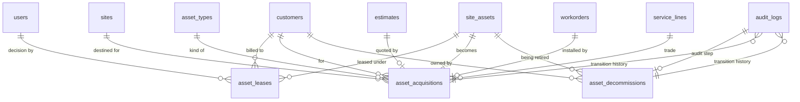

# Phase 13 — Lease & Lifecycle

**Status:** Implemented 2026-04-30
**Depends on:** `site_assets`, `customers`, `users`, `estimates`, `workorders`, `audit_logs`, `asset_types`; Phase 11 (`service_lines`).
**Plan reference:** [`../woms-expansion-plan.md`](../woms-expansion-plan.md) (Phase 13, items M3 / M4 / M5).
**Migration:** [`160_asset_lease_lifecycle.sql`](../../database/migrations/160_asset_lease_lifecycle.sql).

The biggest single phase in the WOMS expansion. Adds three orchestrators that turn a managed-asset lifecycle into first-class platform state — instead of an ad-hoc thread of estimates, POs, and workorders. `asset_leases` (M3) tracks lessor-side terms with idempotent expiry alerting at 90/60/30/0 days. `asset_acquisitions` (M4) walks the front half of the loop (`draft → quoted → approved → po_issued → received → install_scheduled → installed → activated`). `asset_decommissions` (M5) walks the back half (`initiated → wipe → recovery → entitlement → audited → retired`) and atomically flips the underlying `site_assets.status` on the terminal step. All three lean on the existing polymorphic `audit_logs` table for transition history rather than parallel `_events` tables.

---

## 1. What shipped

- **Three new orchestrator tables.** `asset_leases`, `asset_acquisitions`, `asset_decommissions` — each its own state machine, each able to be referenced by audit_logs via `entity_type`.
- **Asset lease record (M3).** `asset_leases` holds lessor terms (start/end, monthly payment in cents, mileage cap for fleet leases, residual + buyout, end-of-lease decision: `renew` / `buyout` / `return` / `replace`). Four `alert_*_sent_at` columns make the daily expiry worker idempotent.
- **Lease expiry cron.** `bin/cron/lease-expiry-alerts.php` runs daily at 08:00. For every active lease whose `end_date` is within 90 days, fires the *single applicable* milestone notice (90, 60, 30, or 0) iff the matching alert column is still NULL.
- **Acquisition workflow (M4).** State machine with 8 forward states + `cancelled`. Each transition is its own POST endpoint (`/api/asset-acquisitions/{id}/quote`, `/approve`, `/po`, `/receive`, `/install`, `/activate`, …) so the UI gets clear affordances and audit events stay narrow. The terminal `activate` step is a separate permission (`asset_acquisitions.activate`) — admin-only, since it links the new asset into the CMDB.
- **Decommission workflow (M5).** State machine with 7 forward states + `cancelled`. Supports a wipe-or-skip branch at initiation (`requires_wipe` flag). Terminal `retire` step is admin-only (`asset_decommissions.retire`) and atomically flips `site_assets.status='retired'` plus `decommissioned_at` in the same transaction.
- **Three new permission triples.** `asset_leases.{view,manage}`, `asset_acquisitions.{view,manage,activate}`, `asset_decommissions.{view,manage,retire}`. Managers get `view+manage` on all three; admins additionally get `.activate` and `.retire`. Dispatchers get `.view` only (so routing accounts for incoming installs and outgoing retirements).
- **Audit-as-history.** Every transition writes an `audit_logs` row with `entity_type='asset_acquisition'` (or `'asset_decommission'`), `event='*.transitioned'`, and `context = {"from": ..., "to": ..., "actor_id": ..., "note": ...}`. The timeline view reads the full history straight from `audit_logs` — no `*_events` tables.
- **HTTP API.** 28 new endpoints across `/api/asset-leases`, `/api/asset-acquisitions`, `/api/asset-decommissions`. Wired via three route modules: [`asset_leases.php`](../../routes/modules/asset_leases.php), [`asset_acquisitions.php`](../../routes/modules/asset_acquisitions.php), [`asset_decommissions.php`](../../routes/modules/asset_decommissions.php).
- **Frontend.** Three new staff views: `views/assets/AssetLeases.jsx`, `AssetAcquisitions.jsx`, `AssetDecommissions.jsx`. Sidebar entries under "Assets" group at `/cp/assets/{leases,acquisitions,decommissions}`. Helpers consolidated in `views/assets/lifecycleHelpers.js`. API client at `services/asset-lifecycle.service.js`.
- **Idempotent migration.** `CREATE TABLE IF NOT EXISTS` on all three; no ALTERs, no DROPs. Re-runs are no-ops.

---

## 2. Data model

### 2.1 New tables

#### `asset_leases` (M3)

| Column                   | Type                | Null | Default              | Notes                                  |
|--------------------------|---------------------|------|----------------------|----------------------------------------|
| `id`                     | `BIGINT UNSIGNED`   | NO   | AUTO_INCREMENT       | PK                                     |
| `site_asset_id`          | `INT UNSIGNED`      | NO   | —                    | FK `site_assets.id` ON DELETE CASCADE  |
| `customer_id`            | `INT UNSIGNED`      | YES  | NULL                 | FK `customers.id` ON DELETE SET NULL — denormalized for fast lookup; the canonical owner is `site_asset → site → company` |
| `lessor_name`            | `VARCHAR(160)`      | NO   | —                    | Free-form (no vendors table yet — matches `site_assets.vendor`) |
| `lessor_contact`         | `VARCHAR(255)`      | YES  | NULL                 |                                        |
| `lease_number`           | `VARCHAR(80)`       | YES  | NULL                 | Lessor's own reference                 |
| `start_date`             | `DATE`              | NO   | —                    |                                        |
| `end_date`               | `DATE`              | NO   | —                    | Required — drives expiry-alert worker  |
| `monthly_payment_cents`  | `BIGINT UNSIGNED`   | YES  | NULL                 | Cents to dodge float rounding; BIGINT for high-value capital leases |
| `payment_schedule`       | `VARCHAR(20)`       | NO   | `'monthly'`          | `monthly` / `quarterly` / `annual` / `custom` |
| `mileage_cap`            | `INT UNSIGNED`      | YES  | NULL                 | Fleet leases                           |
| `current_mileage`        | `INT UNSIGNED`      | YES  | NULL                 | Updated from fleet meter readings (Phase 7.1) |
| `residual_value_cents`   | `BIGINT UNSIGNED`   | YES  | NULL                 |                                        |
| `buyout_price_cents`     | `BIGINT UNSIGNED`   | YES  | NULL                 |                                        |
| `status`                 | `VARCHAR(30)`       | NO   | `'active'`           | See §2.2                                |
| `end_of_lease_decision`  | `VARCHAR(20)`       | YES  | NULL                 | `renew` / `buyout` / `return` / `replace` |
| `decision_made_at`       | `DATETIME`          | YES  | NULL                 |                                        |
| `decision_made_by`       | `INT UNSIGNED`      | YES  | NULL                 | FK `users.id` ON DELETE SET NULL       |
| `alert_90d_sent_at`      | `DATETIME`          | YES  | NULL                 | Idempotency stamp                      |
| `alert_60d_sent_at`      | `DATETIME`          | YES  | NULL                 | Idempotency stamp                      |
| `alert_30d_sent_at`      | `DATETIME`          | YES  | NULL                 | Idempotency stamp                      |
| `alert_0d_sent_at`       | `DATETIME`          | YES  | NULL                 | Idempotency stamp                      |
| `terms`                  | `TEXT`              | YES  | NULL                 |                                        |
| `notes`                  | `TEXT`              | YES  | NULL                 |                                        |
| `attachments`            | `JSON`              | YES  | NULL                 | List of document URLs / IDs            |
| `created_at`             | `TIMESTAMP`         | NO   | `CURRENT_TIMESTAMP`  |                                        |
| `updated_at`             | `TIMESTAMP`         | NO   | `CURRENT_TIMESTAMP ON UPDATE CURRENT_TIMESTAMP` |             |

Indexes: `idx_asset_leases_asset`, `idx_asset_leases_customer`, `idx_asset_leases_status`, `idx_asset_leases_end_date`, `idx_asset_leases_decision_user`. The `end_date` index is what the daily worker hits.

#### `asset_acquisitions` (M4)

Front-half lifecycle orchestrator. 38 columns; the high-value ones:

| Column                          | Type                | Null | Notes                                  |
|---------------------------------|---------------------|------|----------------------------------------|
| `id`                            | `BIGINT UNSIGNED`   | NO   | PK                                     |
| `customer_id`                   | `INT UNSIGNED`      | NO   | FK `customers.id` ON DELETE CASCADE    |
| `site_id`                       | `INT UNSIGNED`      | YES  | FK `sites.id` ON DELETE SET NULL       |
| `service_line_id`               | `BIGINT UNSIGNED`   | YES  | Phase 11 trade tagging                 |
| `asset_type_id`                 | `INT UNSIGNED`      | YES  | FK `asset_types.id` ON DELETE SET NULL |
| `requested_by_user_id`          | `INT UNSIGNED`      | YES  | Internal staff requester               |
| `requested_by_portal_user_id`   | `INT UNSIGNED`      | YES  | Customer-portal requester (one or the other, not both, in practice) |
| `title` / `description`         | `VARCHAR(191)` / `TEXT` | NO/YES | Free text                          |
| `quantity`                      | `INT UNSIGNED`      | NO   | Default 1                              |
| `target_install_date`           | `DATE`              | YES  |                                        |
| `status`                        | `VARCHAR(40)`       | NO   | Default `'draft'`. See §2.2             |
| `estimate_id`                   | `INT UNSIGNED`      | YES  | FK `estimates.id` ON DELETE SET NULL — set at `quote` step |
| `customer_approved_at` / `_by`  | `DATETIME` / `INT`  | YES  | Set at `approve` step                  |
| `customer_rejected_at` / `_reason` | `DATETIME` / `TEXT` | YES | Set at `reject` step                  |
| `vendor_name` / `vendor_po_number` / `vendor_po_total_cents` / `vendor_po_issued_at` | various | YES | Inline PO capture (no `vendor_pos` table yet — Phase 18 introduces formal procurement) |
| `received_at` / `received_by`   | `DATETIME` / `INT`  | YES  |                                        |
| `install_workorder_id`          | `INT UNSIGNED`      | YES  | FK `workorders.id` ON DELETE SET NULL — created lazily at `schedule-install` step |
| `install_scheduled_at`          | `DATETIME`          | YES  |                                        |
| `installed_at`                  | `DATETIME`          | YES  |                                        |
| `target_site_asset_id`          | `INT UNSIGNED`      | YES  | FK `site_assets.id` ON DELETE SET NULL — set at `activate` (this IS the new managed asset row) |
| `activated_at` / `activated_by` | `DATETIME` / `INT`  | YES  | Terminal positive state                |
| `cancelled_at` / `_by` / `_reason` | various          | YES  | Terminal negative state                |
| `last_state_changed_at` / `_by` | `TIMESTAMP` / `INT` | NO/YES | Updated on every transition          |

Indexes on every FK column plus `idx_acq_status` (the workhorse — staff queue groups by status).

#### `asset_decommissions` (M5)

Back-half lifecycle orchestrator. 30 columns; the high-value ones:

| Column                          | Type                | Null | Notes                                  |
|---------------------------------|---------------------|------|----------------------------------------|
| `id`                            | `BIGINT UNSIGNED`   | NO   | PK                                     |
| `site_asset_id`                 | `INT UNSIGNED`      | NO   | FK `site_assets.id` ON DELETE CASCADE — the asset being retired |
| `customer_id`                   | `INT UNSIGNED`      | NO   | FK `customers.id` ON DELETE CASCADE    |
| `requested_by_user_id` / `_portal_user_id` | INT          | YES  | Mirrors acquisition pattern             |
| `reason`                        | `VARCHAR(40)`       | NO   | Default `'eol'` (`eol` / `damaged` / `replaced` / `lost` / `theft` / `customer_requested`) |
| `requires_wipe`                 | `TINYINT(1)`        | NO   | Default 0. True for IT/security/POS — drives the wipe branch |
| `recovery_method`               | `VARCHAR(30)`       | NO   | Default `'none'` (`none` / `vendor_return` / `resale` / `disposal` / `donation` / `redeploy`) |
| `status`                        | `VARCHAR(40)`       | NO   | Default `'initiated'`. See §2.2         |
| `wipe_started_at` / `wipe_completed_at` / `wipe_completed_by` / `wipe_certificate_url` | various | YES | Wipe step audit trail |
| `recovery_started_at` / `_completed_at` / `_by` / `recovery_reference` / `recovery_value_cents` | various | YES | Recovery step audit trail |
| `entitlement_updated_at` / `_by` | `DATETIME` / `INT` | YES  | License/seat reclamation step          |
| `audited_at` / `audited_by`     | `DATETIME` / `INT`  | YES  |                                        |
| `audit_log_id`                  | `BIGINT UNSIGNED`   | YES  | FK `audit_logs.id` ON DELETE SET NULL — direct pointer to the audit row that captured the audit step (faster than scanning audit_logs by entity) |
| `retired_at` / `retired_by`     | `DATETIME` / `INT`  | YES  | Terminal — set when `site_assets.status` flips to `retired` in same txn |
| `cancelled_at` / `_by` / `_reason` | various          | YES  | Terminal negative state                |

Indexes on every FK column plus `idx_decomm_status` and `idx_decomm_audit_log`.

### 2.2 State machines

#### Acquisition (`asset_acquisitions.status`)

```
                   ┌──── reject ────► rejected (terminal)
                   ▼
draft → quote → quoted → approve → approved → po_issued → received
                                                                │
                                                                ▼
                                                        install_scheduled
                                                                │
                                                                ▼
                                                            installed
                                                                │
                                                                ▼
                                                       activated (terminal)

Any state → cancel → cancelled (terminal)
```

Defined in `App\Models\AssetAcquisition::TRANSITIONS`. Allowed forward edges per state are enumerated (no catch-all PATCH); `cancel` is implicitly available from every non-terminal state.

#### Decommission (`asset_decommissions.status`)

```
                   ┌─ requires_wipe=true  ─► wipe_in_progress → wipe_complete ─┐
initiated ─────────┤                                                            ▼
                   └─ requires_wipe=false ──────────────────► recovery_in_progress
                                                                                │
                                                                                ▼
                                                                    recovery_complete
                                                                                │
                                                                                ▼
                                                                  entitlement_updated
                                                                                │
                                                                                ▼
                                                                          audited
                                                                                │
                                                                                ▼
                                                                  retired (terminal — also flips site_assets)

Any state → cancel → cancelled (terminal)
```

The skip-wipe branch is computed in `AssetDecommission::nextStateAfterInitiate()`: if `requires_wipe = false`, `initiated → recovery_in_progress` directly; otherwise `initiated → wipe_in_progress`.

#### Lease (`asset_leases.status`)

Looser machine — leases drift through state via the `decide` endpoint (renew / buyout / return / replace) rather than a strict edge graph:

```
active ──► pending_renewal ──► renewed (re-issued as new lease) | buyout_pending → bought_out | returned
   │
   └────► expired (worker can flip when end_date passed and no decision)
   └────► terminated (manual early termination via /terminate)
```

### 2.3 ER diagram



`audit_logs` is many-to-one onto each orchestrator via the polymorphic `(entity_type, entity_id)` pair — not a hard FK, just a query convention.

---

## 3. API surface

All endpoints sit under `Middleware::auth()` and enforce permissions inside each controller method.

### 3.1 Asset leases · `/api/asset-leases`

| Method | Path                                    | Permission             | Purpose                                |
|--------|-----------------------------------------|------------------------|----------------------------------------|
| GET    | `/api/asset-leases`                     | `asset_leases.view`    | List; filters: `site_asset_id`, `customer_id`, `status`, `expires_before=YYYY-MM-DD`, `expires_after=YYYY-MM-DD` |
| GET    | `/api/asset-leases/{id}`                | `asset_leases.view`    | Single lease                           |
| POST   | `/api/asset-leases`                     | `asset_leases.manage`  | Body: `site_asset_id`, `lessor_name`, `start_date`, `end_date` (required); plus payment + mileage + residual fields |
| PUT    | `/api/asset-leases/{id}`                | `asset_leases.manage`  | Partial update                         |
| POST   | `/api/asset-leases/{id}/decision`       | `asset_leases.manage`  | Body: `decision` ∈ {`renew`,`buyout`,`return`,`replace`}; stamps `decision_made_at`/`_by` |
| POST   | `/api/asset-leases/{id}/terminate`      | `asset_leases.manage`  | Manual early termination → status `terminated` |

### 3.2 Acquisitions · `/api/asset-acquisitions`

| Method | Path                                            | Permission                       | Purpose                                |
|--------|-------------------------------------------------|----------------------------------|----------------------------------------|
| GET    | `/api/asset-acquisitions`                       | `asset_acquisitions.view`        | List; filters: `customer_id`, `site_id`, `service_line_id`, `asset_type_id`, `status`, `estimate_id`, `install_workorder_id` |
| GET    | `/api/asset-acquisitions/{id}`                  | `asset_acquisitions.view`        | Single acquisition (joins requester, estimate, workorder, target asset) |
| POST   | `/api/asset-acquisitions`                       | `asset_acquisitions.manage`      | Create in `draft`. Body: `customer_id`, `title`, `quantity`; optional `site_id`, `service_line_id`, `asset_type_id`, `target_install_date`, `description` |
| PUT    | `/api/asset-acquisitions/{id}`                  | `asset_acquisitions.manage`      | Edit narrative fields (no status changes — use transition endpoints) |
| POST   | `/api/asset-acquisitions/{id}/quote`            | `asset_acquisitions.manage`      | Body: `estimate_id`. `draft → quoted` |
| POST   | `/api/asset-acquisitions/{id}/approve`          | `asset_acquisitions.manage`      | Body: optional `approver_user_id` (defaults to actor). `quoted → approved` |
| POST   | `/api/asset-acquisitions/{id}/reject`           | `asset_acquisitions.manage`      | Body: `reason`. `quoted → rejected` (terminal) |
| POST   | `/api/asset-acquisitions/{id}/po`               | `asset_acquisitions.manage`      | Body: `vendor_name`, `vendor_po_number`, `vendor_po_total_cents`. `approved → po_issued` |
| POST   | `/api/asset-acquisitions/{id}/receive`          | `asset_acquisitions.manage`      | `po_issued → received`. Body: optional `received_at` |
| POST   | `/api/asset-acquisitions/{id}/schedule-install` | `asset_acquisitions.manage`      | Body: `install_workorder_id` OR `branch_id`+`scheduled_at` (creates a new WO). `received → install_scheduled` |
| POST   | `/api/asset-acquisitions/{id}/install`          | `asset_acquisitions.manage`      | `install_scheduled → installed`. Body: optional `installed_at` |
| POST   | `/api/asset-acquisitions/{id}/activate`         | **`asset_acquisitions.activate`** | Body: optional `target_site_asset_id` OR fields to create a new `site_assets` row (`asset_type_id`, `name`, `serial_number`, `site_id`). `installed → activated` (terminal). **Admin-only.** |
| POST   | `/api/asset-acquisitions/{id}/cancel`           | `asset_acquisitions.manage`      | Body: `reason`. Any non-terminal → `cancelled` |

### 3.3 Decommissions · `/api/asset-decommissions`

| Method | Path                                                 | Permission                        | Purpose                                |
|--------|------------------------------------------------------|-----------------------------------|----------------------------------------|
| GET    | `/api/asset-decommissions`                           | `asset_decommissions.view`        | List; filters: `customer_id`, `site_asset_id`, `status`, `requires_wipe`, `recovery_method`, `requested_by_user_id` |
| GET    | `/api/asset-decommissions/{id}`                      | `asset_decommissions.view`        | Single decommission                    |
| POST   | `/api/asset-decommissions`                           | `asset_decommissions.manage`      | Create in `initiated`. Body: `site_asset_id`, `customer_id`, `reason`, `requires_wipe`, `recovery_method`, `notes` |
| PUT    | `/api/asset-decommissions/{id}`                      | `asset_decommissions.manage`      | Edit narrative fields                  |
| POST   | `/api/asset-decommissions/{id}/wipe/start`           | `asset_decommissions.manage`      | `initiated → wipe_in_progress` (only when `requires_wipe=true`) |
| POST   | `/api/asset-decommissions/{id}/wipe/complete`        | `asset_decommissions.manage`      | Body: `wipe_certificate_url`. `wipe_in_progress → wipe_complete` |
| POST   | `/api/asset-decommissions/{id}/recovery/start`       | `asset_decommissions.manage`      | `wipe_complete | initiated → recovery_in_progress` |
| POST   | `/api/asset-decommissions/{id}/recovery/complete`    | `asset_decommissions.manage`      | Body: `recovery_reference`, `recovery_value_cents`. `recovery_in_progress → recovery_complete` |
| POST   | `/api/asset-decommissions/{id}/entitlements`         | `asset_decommissions.manage`      | License/seat reclamation step. `recovery_complete → entitlement_updated` |
| POST   | `/api/asset-decommissions/{id}/audit`                | `asset_decommissions.manage`      | `entitlement_updated → audited`. Stamps `audit_log_id` from the audit_logs row this transition writes |
| POST   | `/api/asset-decommissions/{id}/retire`               | **`asset_decommissions.retire`**  | `audited → retired` (terminal). Same transaction: `UPDATE site_assets SET status='retired', decommissioned_at=NOW() WHERE id = …`. **Admin-only.** |
| POST   | `/api/asset-decommissions/{id}/cancel`               | `asset_decommissions.manage`      | Any non-terminal → `cancelled` |

### 3.4 Audit timeline

Not a phase-13 endpoint per se — the existing `GET /api/audit-logs?entity_type=asset_acquisition&entity_id=<id>` (or `asset_decommission`) returns the full transition history. Each row's `context` JSON has the `{from, to, actor_id, note}` shape, and the timeline view in `AssetAcquisitions.jsx` / `AssetDecommissions.jsx` renders it directly.

---

## 4. Lease expiry alert worker

`bin/cron/lease-expiry-alerts.php`, scheduled at `0 8 * * *` via `bin/cron/run.php`. Wraps `App\Services\Assets\LeaseExpiryAlertService::runDaily($recipients, $today)`.

Algorithm:

1. `AssetLeaseRepository::expiringWithin(90, $today)` returns active leases with `end_date BETWEEN $today AND $today + 90 days`.
2. For each lease, compute `daysLeft = endDate − today`.
3. Pick the **single applicable milestone** — the largest of `{0, 30, 60, 90}` that is `≤ daysLeft`. Example: 47 days → 30-day milestone; 5 days → 0-day milestone.
4. If `lease.alert_<milestone>_sent_at IS NOT NULL`, skip (already sent).
5. Otherwise: dispatch `lease.expiring` mail template to every configured recipient, then `markAlertSent($leaseId, $milestone)` to stamp the column.
6. Audit: write `lease.expiring.notified` event with the `{milestone, days_left, recipients}` context.

**Idempotency invariant:** the worker is safe to run multiple times per day (e.g., in catch-up scenarios) — each lease+milestone combination fires exactly once. A backfill (lease created already inside the 60-day window) only fires the *applicable* milestone, not the historical 90.

Recipients are read from `config/notifications.php` (`lease_expiry.recipients`) — typically the operations / fleet manager mailbox.

---

## 5. Activation and retirement: the two atomic edges

### 5.1 `activate` — acquisition terminal

Single transaction:

1. If body specifies `target_site_asset_id`, verify it exists and belongs to the same `customer_id` as the acquisition.
2. Otherwise, INSERT a new `site_assets` row from the body (`asset_type_id`, `name`, `serial_number`, `site_id`) with `status='active'` and `customer_id` = acquisition's customer.
3. UPDATE the acquisition: set `target_site_asset_id`, `status='activated'`, `activated_at=NOW()`, `activated_by=actor`.
4. Write `audit_logs` row: `entity_type='asset_acquisition'`, `event='acquisition.transitioned'`, `context={"from":"installed","to":"activated","actor_id":…,"target_site_asset_id":…}`.

`asset_acquisitions.activate` is admin-only because it's the moment a new managed asset enters the CMDB. Mis-activating creates downstream confusion (orphaned PM plans, orphaned leases). The wider-cast `asset_acquisitions.manage` covers everything up to but not including this step.

### 5.2 `retire` — decommission terminal

Single transaction:

1. UPDATE the decommission: `status='retired'`, `retired_at=NOW()`, `retired_by=actor`.
2. UPDATE the underlying `site_assets`: `status='retired'`, `decommissioned_at=NOW()`.
3. Write the transition `audit_logs` row.

`asset_decommissions.retire` is admin-only for the symmetric reason: it's the irreversible "this asset is gone" moment, and it pulls the asset out of every dispatch board, PM schedule, and dashboard rollup. We deliberately did not attempt cascading work — open WOs, active leases, current entitlement records are left in their current state and surfaced as warnings on the decommission detail view rather than auto-cancelled.

---

## 6. Frontend integration

### 6.1 Routes

```text
/cp/assets/leases             AssetLeases
/cp/assets/acquisitions       AssetAcquisitions
/cp/assets/decommissions      AssetDecommissions
```

All three under the existing staff shell. Permission-gated client-side via `useAuth().can('asset_leases.view')` etc.

### 6.2 Sidebar

Six "Assets" group entries in `Sidebar.jsx`:

```jsx
{ path: '/cp/assets',                label: 'Installed Assets',     icon: WrenchScrewdriverIcon,    moduleKey: 'assets' },
{ path: '/cp/assets/types',          label: 'Asset Types',          icon: TagIcon,                  moduleKey: 'assets' },
{ path: '/cp/assets/leases',         label: 'Asset Leases',         icon: DocumentDuplicateIcon,    moduleKey: 'assets' },
{ path: '/cp/assets/acquisitions',   label: 'Asset Acquisitions',   icon: ClipboardDocumentListIcon, moduleKey: 'assets' },
{ path: '/cp/assets/decommissions',  label: 'Asset Decommissions',  icon: TrashIcon,                moduleKey: 'assets' },
{ path: '/cp/assets/import',         label: 'Bulk Asset Import',    icon: ArrowUpTrayIcon,          moduleKey: 'assets' },
```

### 6.3 Lifecycle helpers

`views/assets/lifecycleHelpers.js` consolidates the state machine vocabulary into shared helpers (status badges, allowed-next-state lookup, transition button labels) used by all three lifecycle views. Keeps the views readable and prevents three copies of the same state-machine knowledge.

### 6.4 API client

`services/asset-lifecycle.service.js` exposes one method per transition endpoint plus index/show/store/update for each of the three orchestrators. The activate/retire methods carry a clear comment that callers must hold the elevated permission — front-end attempts without it surface as a 403 toast.

---

## 7. Operator runbook

### 7.1 Apply migration

```bash
php migrate.php
# Verifies 160 in sequence after Phase 12 (157-159). Re-running is a no-op.
```

Verification:

```sql
SELECT TABLE_NAME FROM information_schema.tables
 WHERE TABLE_SCHEMA = DATABASE()
   AND TABLE_NAME IN ('asset_leases','asset_acquisitions','asset_decommissions');
-- expect 3 rows
```

### 7.2 Confirming the cron is wired

```bash
php bin/cron/run.php --list | grep lease-expiry-alerts
# Expect: lease-expiry-alerts → 0 8 * * * → bin/cron/lease-expiry-alerts.php
```

Dry-run today's pass without sending:

```bash
php bin/cron/lease-expiry-alerts.php --dry-run
# Reports applicable leases + milestones without dispatching mail or stamping columns
```

### 7.3 Walking an acquisition end-to-end (curl)

```bash
# 1. Create
curl -X POST /api/asset-acquisitions \
  -H 'Content-Type: application/json' -H "Authorization: Bearer $JWT" \
  -d '{"customer_id":42,"title":"New POS terminal — front register","quantity":1}'
# → { data: { id: 17, status: "draft", ... } }

# 2. Quote (after creating an estimate)
curl -X POST /api/asset-acquisitions/17/quote \
  -H "Authorization: Bearer $JWT" -d '{"estimate_id":501}'

# 3. Approve  → 4. PO  → 5. Receive  → 6. Schedule install  → 7. Mark installed
# (see §3.2 for the body shapes)

# 8. Activate (admin only)
curl -X POST /api/asset-acquisitions/17/activate \
  -H "Authorization: Bearer $JWT_ADMIN" \
  -d '{"asset_type_id":12,"name":"Front Register POS","serial_number":"SQ-9988","site_id":3}'
# → { data: { ..., status: "activated", target_site_asset_id: 9001 } }

# Inspect timeline
curl "/api/audit-logs?entity_type=asset_acquisition&entity_id=17"
```

### 7.4 Walking a decommission end-to-end (curl)

```bash
# 1. Initiate (with wipe required)
curl -X POST /api/asset-decommissions \
  -H "Authorization: Bearer $JWT" \
  -d '{"site_asset_id":9001,"customer_id":42,"reason":"eol",
       "requires_wipe":1,"recovery_method":"vendor_return","notes":"…"}'
# → { id: 8, status: "initiated", ... }

# 2. wipe/start  → 3. wipe/complete (with cert URL)
# 4. recovery/start → 5. recovery/complete (with reference, value_cents)
# 6. entitlements (license seat reclaimed)
# 7. audit

# 8. Retire (admin only) — also flips the underlying site_assets row
curl -X POST /api/asset-decommissions/8/retire \
  -H "Authorization: Bearer $JWT_ADMIN" -d '{}'
# → { ..., status: "retired", retired_at: "..." }

# Verify the underlying asset
SELECT id, status, decommissioned_at FROM site_assets WHERE id = 9001;
-- expect status='retired', decommissioned_at NOT NULL
```

### 7.5 Lease expiry sanity checks

```sql
-- Leases coming up in the next 90 days
SELECT id, lessor_name, end_date,
       DATEDIFF(end_date, CURDATE()) AS days_left,
       alert_90d_sent_at, alert_60d_sent_at, alert_30d_sent_at, alert_0d_sent_at
  FROM asset_leases
 WHERE status = 'active'
   AND end_date BETWEEN CURDATE() AND CURDATE() + INTERVAL 90 DAY
 ORDER BY end_date;

-- Re-arm a lease's alert (e.g., resending a 30-day notice after a recipient list change)
UPDATE asset_leases SET alert_30d_sent_at = NULL WHERE id = ?;
-- The next cron run will re-fire IFF days_left is in [0, 30].
```

### 7.6 Rollback (manual; never auto-rollback in production)

```sql
DROP TABLE asset_decommissions;
DROP TABLE asset_acquisitions;
DROP TABLE asset_leases;
```

There are no schema changes to existing tables (no ALTERs on `site_assets`, `workorders`, etc.) — drop order is pure FK direction.

---

## 8. Known gaps

- **No formal `vendor_pos` table** at acquisition time — `vendor_name` / `vendor_po_number` / `vendor_po_total_cents` are captured inline. Phase 18 (S5) introduces real `purchase_orders`; a follow-up could refactor the acquisition flow to FK into a PO row instead of carrying the fields itself.
- **Lease attachments are JSON, not first-class.** Document upload + structured retrieval would mirror Phase 18's `purchase_order_documents` pattern. Today the JSON column is set up to hold URLs/IDs but there's no upload endpoint.
- **No automatic lease auto-status flip.** A lease whose `end_date` has passed without a decision stays `active` until manually touched; the 0-day notice fires but the status doesn't change. Adding an `expired` auto-flip in the daily cron is a small follow-up.
- **`activate` does not auto-create an `asset_leases` row** when the underlying acquisition was for a leased asset — the operator has to create the lease manually after activation. A `lease_at_activate` body field could automate this.
- **Decommission `retire` does not cascade-cancel** open WOs / active leases / current entitlements on the asset — by design, but the UI today only warns operators rather than offering a one-click cleanup.
- **No bulk transitions.** Each acquisition / decommission walks its state machine one transition at a time. A multi-asset acquisition (`quantity = 50`) is a single row; "received 30 of 50" requires editing the orchestrator manually rather than recording partial progress.
- **Audit timeline UI is per-orchestrator only.** There is no cross-orchestrator timeline ("show me everything that happened to asset 9001") — would require a polymorphic query against `audit_logs` plus the related `_workorders.id`, `_leases.id`, etc.
- **Customer-portal acquisition request surface is minimal.** `requested_by_portal_user_id` is captured but the customer portal does not yet have its own list/detail view; portal-side acquisition requests show up in the staff queue and the requester is told via email.

---

## 9. Engineering decisions

- **Why audit_logs as the transition history**, not parallel `asset_acquisition_events` / `asset_decommission_events` tables: `audit_logs` is already polymorphic (`entity_type` VARCHAR + `entity_id` VARCHAR), already indexed, already has a viewer, and already has retention policy. Adding two more event tables would mean writing the same plumbing three times.
- **Why each transition is a separate POST endpoint**, not a single `PATCH /status`: the UI gets clear affordances ("Approve" button vs "Schedule install" button), the audit event is named correctly per action, and per-transition body validation is much simpler. Cost is more endpoints; benefit is no string-state-machine in the controller.
- **Why `activate` and `retire` are separate permissions** from `manage`: both are irreversible CMDB-mutating operations — `activate` introduces a new managed asset, `retire` removes one from active fleet. Separation of duties matters here even when the same person (small shop admin) ends up holding both. Pre-shipping with the permission split avoids a painful retro-RBAC migration later.
- **Why `asset_leases.customer_id` is denormalized** (the canonical owner is `site_asset → site → company`): the daily expiry cron sorts/filters by customer in many notification flows. A denormalized FK lets the worker hit one index instead of three joins. Trade-off accepted; backfill on customer reassignment is a small follow-up if it ever happens.
- **Why money is `BIGINT UNSIGNED` in cents** (not `DECIMAL(12,2)`): existing money columns in the codebase use both shapes; for capital-lease values that can reach 8-figure sums (forklift fleet, MRI machine), BIGINT cents removes any decimal-rounding ambiguity in worker logic. Display-side conversion happens in the controller.
- **Why the wipe step is conditional** on `requires_wipe` rather than always running: a property-mgmt or equipment vertical decommissioning a hand drill doesn't need a wipe-certificate URL. Forcing the state on those flows would just add nuisance "skip" clicks. The branch is computed in the model (`AssetDecommission::nextStateAfterInitiate()`) so it's not duplicated in the controller.
- **Why the four `alert_*_sent_at` columns** instead of one `last_alert_sent_at`: a backfill case (lease created at 25 days remaining) should NOT pretend to have sent the 90/60 notices. With per-milestone columns we can stamp only the ones we actually skipped (or leave them all NULL) and still get correct future behaviour. With one column, the backfill is ambiguous — was the existing date the 90 or the 60?
- **Why `target_site_asset_id` is FK SET NULL** (not RESTRICT): if an asset is later hard-deleted (rare but allowed by the existing CMDB flow), we don't want to block the historical acquisition record. The activation-time link is captured both in the FK and in `audit_logs`, so deleting the FK target loses live navigation but not audit history.
- **Why the lease worker idempotency lives in the database** (per-milestone columns) rather than in a separate `notification_logs` table: stamping the lease row makes the "should I send?" check a single-row read on the leases table the worker is already iterating, not a cross-table join. Keeps the worker's algorithmic complexity O(N).

---

## 10. Files of record

**Migrations**
- [`database/migrations/160_asset_lease_lifecycle.sql`](../../database/migrations/160_asset_lease_lifecycle.sql)

**Models**
- `src/Models/AssetLease.php` — `STATUS_*`, `DECISION_*`, `SCHEDULE_*`
- `src/Models/AssetAcquisition.php` — `STATUS_*`, `TRANSITIONS`, `TERMINAL_STATUSES`
- `src/Models/AssetDecommission.php` — `STATUS_*`, `TRANSITIONS`, `nextStateAfterInitiate()`

**Services**
- `src/Services/Assets/AssetLeaseController.php` · `AssetLeaseRepository.php`
- `src/Services/Assets/AssetAcquisitionController.php` · `AssetAcquisitionService.php` · `AssetAcquisitionRepository.php`
- `src/Services/Assets/AssetDecommissionController.php` · `AssetDecommissionService.php` · `AssetDecommissionRepository.php`
- `src/Services/Assets/LeaseExpiryAlertService.php`
- `src/Services/Assets/AssetLifecycleService.php` — shared helpers

**Routes**
- [`routes/modules/asset_leases.php`](../../routes/modules/asset_leases.php)
- [`routes/modules/asset_acquisitions.php`](../../routes/modules/asset_acquisitions.php)
- [`routes/modules/asset_decommissions.php`](../../routes/modules/asset_decommissions.php)

**Frontend**
- `src/react/views/assets/AssetLeases.jsx`
- `src/react/views/assets/AssetAcquisitions.jsx`
- `src/react/views/assets/AssetDecommissions.jsx`
- `src/react/views/assets/lifecycleHelpers.js`
- `src/services/asset-lifecycle.service.js`
- `src/react/router/index.jsx` — `/cp/assets/{leases,acquisitions,decommissions}` routes
- `src/react/components/layout/Sidebar.jsx` — Assets group entries

**Cron**
- `bin/cron/lease-expiry-alerts.php` — 08:00 daily, registered in `bin/cron/run.php`

**Permissions**
- `src/Support/Auth/RolePermissions.php` — `asset_leases.{view,manage}`, `asset_acquisitions.{view,manage,activate}`, `asset_decommissions.{view,manage,retire}`
- `config/auth.php` — role assignments (manager: view+manage; admin: + activate/retire; dispatcher: view-only)
