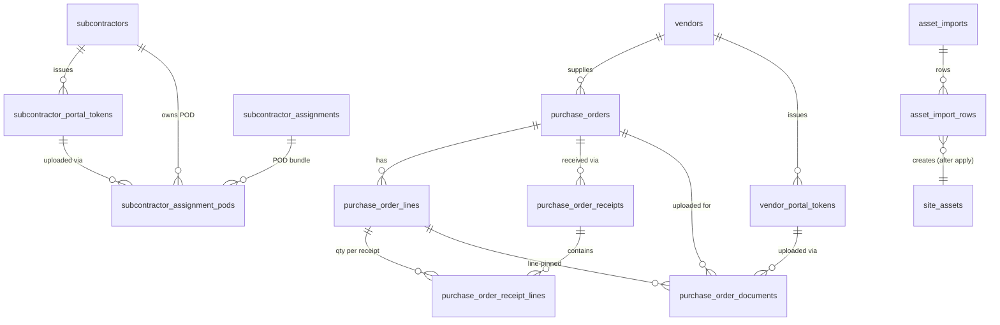

# Phase 18 — Vendor & Subcontractor Self-Service

**Status:** Implemented 2026-05-03
**Depends on:** Migration 152 (`service_lines`); Phase 1 CRM (`subcontractors`, `subcontractor_assignments`); Phase 2 Assets (`site_assets`, `asset_types`, `sites`); Phase 6.6 portal upload infrastructure (`App\Services\Portal\PortalUploadStorage`, `PortalUploadValidator`); existing `users`, `customers`, `workorders`, `inventory_items` tables.
**Plan references:** [`../woms-expansion-plan.md`](../woms-expansion-plan.md) (Phase 18, items C1/C2/S5/S12).
**Migrations:**
- [`database/migrations/170_subcontractor_portal.sql`](../../database/migrations/170_subcontractor_portal.sql) — Sub portal (C2)
- [`database/migrations/171_asset_imports.sql`](../../database/migrations/171_asset_imports.sql) — Bulk asset import (S12)
- [`database/migrations/172_procurement.sql`](../../database/migrations/172_procurement.sql) — Procurement / PO lifecycle (S5)
- [`database/migrations/173_vendor_portal.sql`](../../database/migrations/173_vendor_portal.sql) — Vendor portal (C1)

Phase 18 closes the WOMS expansion with four loosely coupled features that reduce phone/email friction at the operational edges:

- **S5 — Procurement & PO lifecycle.** First-class `vendors` table plus a five-state PO state machine (`draft → sent → partial → received → closed`, with terminal `cancelled`) and a per-shipment receipt log. Replaces the prior name-only entries in `inventory_lookups`.
- **S12 — Bulk asset import (CSV).** Two-step upload→dry-run→apply workflow with a durable per-row error trail. Designed for 5k+-row migrations from external CMMS exports.
- **C2 — Subcontractor self-service portal.** Token-authenticated public portal where subs accept/decline/start/complete their assignments and upload POD/photo/signature bundles without a JWT staff account.
- **C1 — Vendor self-service portal.** Token-authenticated public portal where procurement vendors acknowledge POs, mark line shipments with tracking + carrier, and upload tracking labels / packing slips / invoices.

Two distinct shapes ship side-by-side: **back-office workflow tooling** (S5, S12) lives behind the staff JWT, and **public token-authenticated portals** (C1, C2) are deliberately segregated from the JWT stack so a leaked token never opens cross-tenant access.

---

## 1. What shipped

### 1.1 Procurement (S5)

- **Vendor master.** `vendors` table with contact info, payment terms (`Net-N` advisory string), default currency, 1099 eligibility, consignment partner flag.
- **PO header + lines + receipts.** `purchase_orders`, `purchase_order_lines`, `purchase_order_receipts`, `purchase_order_receipt_lines`. Every receipt is a separate event (one row per shipment) so partial receiving leaves a forensic trail.
- **State machine.** `draft → sent → partial → received → closed`; `cancelled` reachable from `draft`/`sent`/`partial` provided no quantity has been received against any line. Header `status` mirrors the rolled-up line `status` after each receipt event.
- **PO kinds.** `internal` (consumables, fleet parts) vs `customer_billable` (markup applied via `markup_pct`, routed to `customer_id`/`workorder_id`). Header carries the kind; lines inherit it implicitly.
- **Consignment.** `vendors.is_consignment_partner` plus per-PO `is_consigned` override. When `is_consigned=1` a receipt does **not** increment inventory — stock stays vendor-owned until consumption (handled outside this phase).
- **Receive workflow.** `POST /api/purchase-orders/{id}/receive` accepts an array of `{ purchase_order_line_id, quantity_received, notes }` rows; service validates against outstanding qty, writes receipt + receipt_line rows, increments `purchase_order_lines.quantity_received`, recalculates header totals, and transitions header `status` (sent→partial→received) atomically.
- **Permissions.** Three new entries registered in `App\Support\Auth\RolePermissions`:
  - `procurement.view` — list/show vendors and POs (admin, manager, parts).
  - `procurement.manage` — create/edit/cancel vendors and POs (admin, manager).
  - `procurement.receive` — receive endpoint only; given to the parts role so receivers can do their job without full PO authoring rights.
- **Backend.** `App\Models\{Vendor,PurchaseOrder,PurchaseOrderLine,PurchaseOrderReceipt,PurchaseOrderReceiptLine}`, `App\Services\Procurement\{VendorRepository,VendorService,VendorController,PurchaseOrderRepository,PurchaseOrderService,PurchaseOrderController}`. Routes module: [`routes/modules/procurement.php`](../../routes/modules/procurement.php).
- **Frontend.** `src/services/{vendors,purchase-orders}.service.js`; pages `src/react/views/procurement/{Vendors,PurchaseOrders,PurchaseOrderDetail}.jsx`; sidebar entries under "Inventory".

### 1.2 Bulk asset import (S12)

- **Two-table design.** `asset_imports` (header with status, defaults, mapping, counts) + `asset_import_rows` (one row per CSV data line, with raw and parsed JSON).
- **Status flow.** `pending → validated → applying → applied`; terminal sidetracks `failed` and `cancelled`. Each transition is gated server-side; you cannot apply a non-validated import.
- **Mapping + defaults.** `mapping` JSON maps `csv_column_name → site_assets_field`. Header `default_site_id` / `default_division_id` / `default_asset_type_id` apply to every row when the CSV column is blank or unmapped.
- **Per-row durable errors.** `asset_import_rows.error_message` stays in the table after apply. Operators can audit which rows the system rejected and why, even months later.
- **Permissions.** Reuses existing `assets.view` and `assets.manage` (no new entries). The service enforces `assets.manage` on every mutating call.
- **Backend.** `App\Models\{AssetImport,AssetImportRow}`, `App\Services\Assets\{AssetImportRepository,AssetImportService,AssetImportController}`. Routes module: [`routes/modules/asset_imports.php`](../../routes/modules/asset_imports.php).
- **Frontend.** `src/services/asset-imports.service.js`; page `src/react/views/assets/AssetImport.jsx` (upload → mapping → validate → apply UI).

### 1.3 Subcontractor portal (C2)

- **Token table.** `subcontractor_portal_tokens` with hashed token (`SHA-256` of plaintext, stored in `token_hash CHAR(64)`), per-token `label`, optional `expires_at`, `last_used_at` / `last_used_ip` for forensics, and `revoked_at` + `revoked_reason`.
- **POD bundle.** `subcontractor_assignment_pods` carries uploaded blobs (POD paperwork, photos, signatures, text-only notes) keyed to a single `subcontractor_assignments` row. Soft-deleted via `deleted_at` to preserve audit chain.
- **Plaintext prefix.** Issued tokens are prefixed `sub_` (e.g. `sub_<64 hex chars>`) so leaked credentials self-identify which portal they belong to. The prefix is stripped before hashing.
- **State actions.** `accept | decline | start | complete` from the public portal. Allowed transitions enforced server-side via the existing `SubcontractorAssignment` state machine — the portal cannot bypass it.
- **Permissions.** `subcontractors.view` / `subcontractors.manage` registered in `RolePermissions`; admin/manager/dispatcher get manage, technician/parts get view. Sub-facing endpoints check token validity, **not** a permission — the token IS the auth.
- **Throttling.** Public surface is wrapped in `Middleware::throttle(60, 60)` (60 requests per minute per IP) since the token is the only credential and brute-force sweep is the realistic attack vector.
- **Backend.** `App\Models\{SubcontractorPortalToken,SubcontractorAssignmentPod}`, `App\Services\Subcontractor\{SubcontractorPortalTokenRepository,SubcontractorAssignmentPodRepository,SubcontractorPortalService,SubcontractorPortalController}`. Routes module: [`routes/modules/subcontractor_portal.php`](../../routes/modules/subcontractor_portal.php).
- **Frontend.** `src/services/{sub-portal-tokens,sub-portal}.service.js`; staff page `src/react/views/sub-portal/SubPortalTokens.jsx`; public page `src/react/views/sub-portal/SubPortal.jsx` (routed at `/sub-portal/:token` and `/sub-portal?token=…`).

### 1.4 Vendor portal (C1)

- **Token table.** `vendor_portal_tokens` — same shape as the sub portal token table but bound to `vendors.id` (BIGINT) instead of `subcontractors.id` (INT). Plaintext prefix is `ven_`.
- **PO documents.** `purchase_order_documents` carries uploaded blobs (tracking labels, packing slips, vendor invoices, "other"). Optionally pinned to a single `purchase_order_lines` row when the document covers one specific shipment SKU. Includes structured `tracking_number` + `carrier` columns so tracking metadata is queryable without parsing notes.
- **Acknowledgement.** `purchase_orders.vendor_acknowledged_at` + `vendor_acknowledged_via_token_id` capture when (and via which token) the vendor confirmed receipt of the PO. Idempotent — re-calling the endpoint is a no-op.
- **Line shipment tracking.** `purchase_order_lines.vendor_shipped_at`, `vendor_tracking_number`, `vendor_carrier` carry the vendor-side shipment state. **Does not** modify `quantity_received` — receiving stays a staff action via `/api/purchase-orders/{id}/receive`.
- **Document delete authority.** Vendors can only delete documents they uploaded themselves (`uploaded_via_token_id` resolves to a token bound to their vendor); staff-uploaded documents are immutable from the public portal.
- **DRAFT visibility.** The portal hides any PO with `status='draft'` so vendors don't see internal staging work.
- **Backend.** `App\Models\{VendorPortalToken,PurchaseOrderDocument}`, `App\Services\Procurement\{VendorPortalTokenRepository,PurchaseOrderDocumentRepository,VendorPortalService,VendorPortalController}`. Routes module: [`routes/modules/vendor_portal.php`](../../routes/modules/vendor_portal.php).
- **Frontend.** `src/services/{vendor-portal-tokens,vendor-portal}.service.js`; staff page `src/react/views/vendor-portal/VendorPortalTokens.jsx`; public page `src/react/views/vendor-portal/VendorPortal.jsx` (routed at `/vendor-portal/:token` and `/vendor-portal?token=…`).

---

## 2. Data model

### 2.1 Procurement tables (migration 172)

#### `vendors`

| Column                   | Type               | Null | Default              | Notes                                       |
|--------------------------|--------------------|------|----------------------|---------------------------------------------|
| `id`                     | `BIGINT UNSIGNED`  | NO   | AUTO_INCREMENT       | PK                                          |
| `name`                   | `VARCHAR(191)`     | NO   | —                    |                                             |
| `code`                   | `VARCHAR(60)`      | YES  | NULL                 | UNIQUE; stable external key                 |
| `status`                 | `VARCHAR(20)`      | NO   | `'active'`           | `active` \| `inactive`                      |
| `primary_contact_name`   | `VARCHAR(120)`     | YES  | NULL                 |                                             |
| `email`, `phone`, `website` | various         | YES  | NULL                 |                                             |
| address fields           | various            | YES  | NULL                 | `street`/`city`/`state`/`postal_code`/`country` |
| `payment_terms`          | `VARCHAR(20)`      | YES  | NULL                 | Net-N advisory; AP system owns due-date math |
| `currency`               | `CHAR(3)`          | YES  | `'USD'`              |                                             |
| `tax_id`                 | `VARCHAR(40)`      | YES  | NULL                 | Used for 1099 reporting                     |
| `requires_1099`          | `TINYINT(1)`       | NO   | 0                    |                                             |
| `is_consignment_partner` | `TINYINT(1)`       | NO   | 0                    | Default for new POs from this vendor        |
| `notes`                  | `TEXT`             | YES  | NULL                 |                                             |
| `created_at` / `updated_at` | `DATETIME`      | NO   | `CURRENT_TIMESTAMP`  |                                             |

Indexes: `uk_vendors_code (code)`, `idx_vendors_status (status)`, `idx_vendors_name (name)`.

#### `purchase_orders`

| Column                            | Type               | Null | Default              | FK target / notes                                    |
|-----------------------------------|--------------------|------|----------------------|------------------------------------------------------|
| `id`                              | `BIGINT UNSIGNED`  | NO   | AUTO_INCREMENT       | PK                                                   |
| `po_number`                       | `VARCHAR(40)`      | NO   | —                    | UNIQUE; minted in `PurchaseOrderService::mintPoNumber` |
| `vendor_id`                       | `BIGINT UNSIGNED`  | NO   | —                    | `vendors(id)` ON DELETE **RESTRICT**                 |
| `status`                          | `VARCHAR(20)`      | NO   | `'draft'`            | `draft \| sent \| partial \| received \| closed \| cancelled` |
| `kind`                            | `VARCHAR(20)`      | NO   | `'internal'`         | `internal \| customer_billable`                      |
| `customer_id` / `site_id` / `workorder_id` | `INT UNSIGNED` | YES | NULL              | `customers/sites/workorders(id)` ON DELETE SET NULL  |
| `currency`                        | `CHAR(3)`          | NO   | `'USD'`              |                                                      |
| `markup_pct`                      | `DECIMAL(7,4)`     | YES  | NULL                 | Applied at sell-price derivation when `customer_billable` |
| `is_consigned`                    | `TINYINT(1)`       | NO   | 0                    | Receipt does **not** increment inventory when true   |
| `subtotal_cents` / `tax_cents` / `shipping_cents` / `total_cents` | `INT UNSIGNED` | NO | 0 | Recalc on every line change / receipt              |
| `notes`                           | `TEXT`             | YES  | NULL                 |                                                      |
| `ordered_at` / `expected_at` / `received_at` / `closed_at` / `cancelled_at` | DATETIME / DATE | YES | NULL | Lifecycle timestamps                          |
| `cancel_reason`                   | `VARCHAR(255)`     | YES  | NULL                 |                                                      |
| `vendor_acknowledged_at`          | `DATETIME`         | YES  | NULL                 | Set by vendor portal (migration 173)                 |
| `vendor_acknowledged_via_token_id`| `BIGINT UNSIGNED`  | YES  | NULL                 | Forensic: which token did it (migration 173, no FK)  |
| `created_by_user_id`              | `INT UNSIGNED`     | YES  | NULL                 | `users(id)` ON DELETE SET NULL                       |
| `created_at` / `updated_at`       | `DATETIME`         | NO   | `CURRENT_TIMESTAMP`  |                                                      |

Indexes: `uk_po_number`, `idx_po_vendor`, `idx_po_status (status, created_at)`, `idx_po_workorder`, `idx_po_customer`. The `vendor_id` FK is **RESTRICT** on purpose — orphaning a PO would corrupt receivables; admins must clear POs before deleting a vendor.

#### `purchase_order_lines`

| Column                  | Type               | Null | Default              | FK target / notes                                   |
|-------------------------|--------------------|------|----------------------|-----------------------------------------------------|
| `id`                    | `BIGINT UNSIGNED`  | NO   | AUTO_INCREMENT       | PK                                                  |
| `purchase_order_id`     | `BIGINT UNSIGNED`  | NO   | —                    | `purchase_orders(id)` ON DELETE CASCADE             |
| `line_number`           | `INT UNSIGNED`     | NO   | —                    | Monotonic per PO; managed by repository on insert   |
| `description`           | `VARCHAR(500)`     | NO   | —                    |                                                     |
| `sku`                   | `VARCHAR(120)`     | YES  | NULL                 |                                                     |
| `inventory_item_id`     | `INT UNSIGNED`     | YES  | NULL                 | `inventory_items(id)` ON DELETE SET NULL — receipt updates stock when set |
| `site_asset_id`         | `INT UNSIGNED`     | YES  | NULL                 | `site_assets(id)` ON DELETE SET NULL — earmarks part for asset |
| `quantity_ordered`      | `DECIMAL(12,3)`    | NO   | 0                    |                                                     |
| `quantity_received`     | `DECIMAL(12,3)`    | NO   | 0                    | Incremented atomically by `receive` endpoint        |
| `unit_cost_cents`       | `INT UNSIGNED`     | NO   | 0                    |                                                     |
| `tax_cents`             | `INT UNSIGNED`     | NO   | 0                    |                                                     |
| `line_total_cents`      | `INT UNSIGNED`     | NO   | 0                    | `qty × unit_cost + tax`; recalculated on every save |
| `notes`                 | `TEXT`             | YES  | NULL                 |                                                     |
| `status`                | `VARCHAR(20)`      | NO   | `'pending'`          | `pending \| partial \| received \| cancelled`       |
| `vendor_shipped_at`     | `DATETIME`         | YES  | NULL                 | Set by vendor portal (migration 173)                |
| `vendor_tracking_number`| `VARCHAR(120)`     | YES  | NULL                 | Set by vendor portal (migration 173)                |
| `vendor_carrier`        | `VARCHAR(80)`      | YES  | NULL                 | Set by vendor portal (migration 173)                |
| `created_at` / `updated_at` | `DATETIME`     | NO   | `CURRENT_TIMESTAMP`  |                                                     |

Indexes: `idx_po_line_po (purchase_order_id, line_number)`, `idx_po_line_inventory`, `idx_po_line_asset`.

#### `purchase_order_receipts` + `purchase_order_receipt_lines`

One receipt event per shipment; per-line received quantities live in the receipt-lines child table. CASCADE both ways from receipts and from PO/PO-line deletes.

| Table | Key columns |
|---|---|
| `purchase_order_receipts` | `id`, `purchase_order_id` (FK CASCADE), `received_at`, `received_by_user_id` (FK SET NULL), `packing_slip_ref`, `notes` |
| `purchase_order_receipt_lines` | `id`, `receipt_id` (FK CASCADE), `purchase_order_line_id` (FK CASCADE), `quantity_received`, `notes` |

### 2.2 Asset import tables (migration 171)

#### `asset_imports`

| Column                  | Type               | Null | Default              | Notes                                            |
|-------------------------|--------------------|------|----------------------|--------------------------------------------------|
| `id`                    | `BIGINT UNSIGNED`  | NO   | AUTO_INCREMENT       | PK                                               |
| `status`                | `VARCHAR(20)`      | NO   | `'pending'`          | See §2.2.1                                       |
| `original_filename`     | `VARCHAR(255)`     | YES  | NULL                 |                                                  |
| `mapping`               | `JSON`             | YES  | NULL                 | `{csv_column: site_assets_field, …}`             |
| `default_site_id`       | `INT UNSIGNED`     | YES  | NULL                 | `sites(id)` SET NULL                             |
| `default_division_id`   | `INT UNSIGNED`     | YES  | NULL                 | (no FK — divisions table not always present)     |
| `default_asset_type_id` | `INT UNSIGNED`     | YES  | NULL                 | `asset_types(id)` SET NULL                       |
| `total_rows`            | `INT UNSIGNED`     | NO   | 0                    | All non-header CSV rows                          |
| `valid_rows`            | `INT UNSIGNED`     | NO   | 0                    | Rows passing dry-run                             |
| `error_rows`            | `INT UNSIGNED`     | NO   | 0                    | Rows failing dry-run                             |
| `created_rows`          | `INT UNSIGNED`     | NO   | 0                    | Successful inserts after apply                   |
| `started_by_user_id`    | `INT UNSIGNED`     | YES  | NULL                 | `users(id)` SET NULL                             |
| `started_at`            | `DATETIME`         | NO   | `CURRENT_TIMESTAMP`  |                                                  |
| `validated_at`          | `DATETIME`         | YES  | NULL                 |                                                  |
| `applied_at`            | `DATETIME`         | YES  | NULL                 |                                                  |
| `notes`                 | `TEXT`             | YES  | NULL                 |                                                  |

Indexes: `idx_asset_imports_status (status, started_at)`, `idx_asset_imports_user`.

##### 2.2.1 Status flow

```
                            ┌──────────────┐  validate(import)        ┌────────────┐
              upload  ─────▶│   pending    │ ───────────────────────▶ │  validated │
                            └──────────────┘                          └─────┬──────┘
                                    │                                       │ apply(import)
                                    │ cancel                                ▼
                                    │                                ┌────────────┐
                                    └────────────────────────────▶   │ applying   │
                                                                     └─────┬──────┘
                                                                           │
                                                            on completion: │
                                                                           ▼
                                                  ┌────────────┐    ┌────────────┐
                                                  │   failed   │ ◀──│  applied   │
                                                  └────────────┘    └────────────┘
                                                          ▲
                                              ┌───────────┘
                                              │  cancel
                                       ┌──────┴──────┐
                                       │ cancelled   │
                                       └─────────────┘
```

#### `asset_import_rows`

| Column              | Type               | Null | Default              | Notes                                              |
|---------------------|--------------------|------|----------------------|----------------------------------------------------|
| `id`                | `BIGINT UNSIGNED`  | NO   | AUTO_INCREMENT       | PK                                                 |
| `import_id`         | `BIGINT UNSIGNED`  | NO   | —                    | `asset_imports(id)` ON DELETE CASCADE              |
| `row_number`        | `INT UNSIGNED`     | NO   | —                    | 1-based, matches CSV line number                   |
| `raw_data`          | `JSON`             | NO   | —                    | `{csv_column: raw_value}` — re-validatable         |
| `parsed_data`       | `JSON`             | YES  | NULL                 | Post-mapping site_assets-shaped payload            |
| `status`            | `VARCHAR(20)`      | NO   | `'pending'`          | `pending \| validated \| invalid \| created`       |
| `error_message`     | `VARCHAR(500)`     | YES  | NULL                 |                                                    |
| `created_asset_id`  | `INT UNSIGNED`     | YES  | NULL                 | `site_assets(id)` SET NULL — populated after apply |

Indexes: `idx_asset_import_rows_import (import_id, row_number)`, `idx_asset_import_rows_status (import_id, status)`.

### 2.3 Subcontractor portal tables (migration 170)

#### `subcontractor_portal_tokens`

| Column                  | Type               | Null | Default              | Notes                                              |
|-------------------------|--------------------|------|----------------------|----------------------------------------------------|
| `id`                    | `BIGINT UNSIGNED`  | NO   | AUTO_INCREMENT       | PK                                                 |
| `subcontractor_id`      | `INT UNSIGNED`     | NO   | —                    | `subcontractors(id)` ON DELETE CASCADE             |
| `token_hash`            | `CHAR(64)`         | NO   | —                    | UNIQUE; SHA-256 of plaintext (post-prefix-strip)   |
| `label`                 | `VARCHAR(120)`     | YES  | NULL                 | Operator-set name (e.g. "Acme Plumbing — Carlos")  |
| `expires_at`            | `DATETIME`         | YES  | NULL                 | NULL = no expiry                                   |
| `last_used_at`          | `DATETIME`         | YES  | NULL                 | Updated by `recordUse` on every successful auth    |
| `last_used_ip`          | `VARCHAR(45)`      | YES  | NULL                 |                                                    |
| `revoked_at`            | `DATETIME`         | YES  | NULL                 | Hard-revoke; future auth attempts return null      |
| `revoked_reason`        | `VARCHAR(255)`     | YES  | NULL                 |                                                    |
| `created_by_user_id`    | `INT UNSIGNED`     | YES  | NULL                 | `users(id)` ON DELETE SET NULL                     |
| `created_at`            | `DATETIME`         | NO   | `CURRENT_TIMESTAMP`  |                                                    |

Indexes: `uk_sub_portal_token_hash`, `idx_sub_portal_token_sub`, `idx_sub_portal_token_active (subcontractor_id, revoked_at, expires_at)`.

#### `subcontractor_assignment_pods`

| Column                  | Type               | Null | Default              | Notes                                              |
|-------------------------|--------------------|------|----------------------|----------------------------------------------------|
| `id`                    | `BIGINT UNSIGNED`  | NO   | AUTO_INCREMENT       | PK                                                 |
| `assignment_id`         | `INT UNSIGNED`     | NO   | —                    | `subcontractor_assignments(id)` ON DELETE CASCADE  |
| `subcontractor_id`      | `INT UNSIGNED`     | NO   | —                    | `subcontractors(id)` ON DELETE CASCADE; denormalized for tenant filter |
| `kind`                  | `VARCHAR(20)`      | NO   | `'pod'`              | `pod \| photo \| signature \| note`                |
| `original_name`         | `VARCHAR(255)`     | YES  | NULL                 |                                                    |
| `stored_path`           | `VARCHAR(512)`     | YES  | NULL                 | Relative to `PortalUploadStorage` root             |
| `mime_type`             | `VARCHAR(120)`     | YES  | NULL                 |                                                    |
| `size_bytes`            | `INT UNSIGNED`     | YES  | NULL                 |                                                    |
| `sha256`                | `CHAR(64)`         | YES  | NULL                 | Content fingerprint (validation step)              |
| `notes`                 | `TEXT`             | YES  | NULL                 | For `kind='note'`, this carries the entire payload |
| `uploaded_via_token_id` | `BIGINT UNSIGNED`  | YES  | NULL                 | `subcontractor_portal_tokens(id)` ON DELETE SET NULL |
| `uploaded_at`           | `DATETIME`         | NO   | `CURRENT_TIMESTAMP`  |                                                    |
| `deleted_at`            | `DATETIME`         | YES  | NULL                 | Soft delete                                        |

Indexes: `idx_sub_pod_assignment (assignment_id, deleted_at)`, `idx_sub_pod_sub (subcontractor_id, deleted_at)`, `idx_sub_pod_kind`.

### 2.4 Vendor portal tables (migration 173)

#### `vendor_portal_tokens`

Identical shape to `subcontractor_portal_tokens` except `vendor_id BIGINT UNSIGNED` (matching the BIGINT `vendors.id`). Indexes: `uk_vendor_portal_token_hash`, `idx_vendor_portal_token_vendor`, `idx_vendor_portal_token_active (vendor_id, revoked_at, expires_at)`.

#### `purchase_order_documents`

| Column                  | Type               | Null | Default              | Notes                                              |
|-------------------------|--------------------|------|----------------------|----------------------------------------------------|
| `id`                    | `BIGINT UNSIGNED`  | NO   | AUTO_INCREMENT       | PK                                                 |
| `purchase_order_id`     | `BIGINT UNSIGNED`  | NO   | —                    | `purchase_orders(id)` ON DELETE CASCADE            |
| `purchase_order_line_id`| `BIGINT UNSIGNED`  | YES  | NULL                 | `purchase_order_lines(id)` ON DELETE SET NULL — pinned to a single line for line-specific shipments |
| `kind`                  | `VARCHAR(20)`      | NO   | `'tracking'`         | `tracking \| packing_slip \| invoice \| other`     |
| `original_name`         | `VARCHAR(255)`     | YES  | NULL                 |                                                    |
| `stored_path`           | `VARCHAR(512)`     | YES  | NULL                 | Relative to `PortalUploadStorage` root             |
| `mime_type`             | `VARCHAR(120)`     | YES  | NULL                 |                                                    |
| `size_bytes`            | `INT UNSIGNED`     | YES  | NULL                 |                                                    |
| `sha256`                | `CHAR(64)`         | YES  | NULL                 |                                                    |
| `tracking_number`       | `VARCHAR(120)`     | YES  | NULL                 | Indexed for cross-PO tracking lookup               |
| `carrier`               | `VARCHAR(80)`      | YES  | NULL                 |                                                    |
| `notes`                 | `TEXT`             | YES  | NULL                 |                                                    |
| `uploaded_via_token_id` | `BIGINT UNSIGNED`  | YES  | NULL                 | `vendor_portal_tokens(id)` ON DELETE SET NULL — NULL when staff upload |
| `uploaded_by_user_id`   | `INT UNSIGNED`     | YES  | NULL                 | `users(id)` ON DELETE SET NULL — set when staff upload |
| `uploaded_at`           | `DATETIME`         | NO   | `CURRENT_TIMESTAMP`  |                                                    |
| `deleted_at`            | `DATETIME`         | YES  | NULL                 | Soft delete                                        |

Indexes: `idx_po_doc_po (purchase_order_id, deleted_at)`, `idx_po_doc_line`, `idx_po_doc_kind`, `idx_po_doc_tracking`.

### 2.5 ER diagram (Phase 18 only)



---

## 3. API surface

All endpoints follow the project's `{ success, data, message }` envelope. Examples below show the inner `data` payload only.

### 3.1 Procurement (S5) — `Middleware::auth()`

| Method | Path                                            | Permission              | Purpose                                                          |
|--------|-------------------------------------------------|-------------------------|------------------------------------------------------------------|
| GET    | `/api/vendors`                                  | `procurement.view`      | List with `status`/`query`/`consignment_only`/`limit`/`offset`   |
| POST   | `/api/vendors`                                  | `procurement.manage`    | Create                                                           |
| GET    | `/api/vendors/{id}`                             | `procurement.view`      | Show                                                             |
| PATCH  | `/api/vendors/{id}`                             | `procurement.manage`    | Partial update                                                   |
| DELETE | `/api/vendors/{id}`                             | `procurement.manage`    | Delete (FK RESTRICT — fails if any PO references vendor)         |
| GET    | `/api/purchase-orders`                          | `procurement.view`      | List with `vendor_id`/`status`/`workorder_id`/`customer_id`/`query` |
| POST   | `/api/purchase-orders`                          | `procurement.manage`    | Create draft (auto-mints `po_number`)                            |
| GET    | `/api/purchase-orders/{id}`                     | `procurement.view`      | Header + lines + receipts                                        |
| PATCH  | `/api/purchase-orders/{id}`                     | `procurement.manage`    | Update header (locked once received)                             |
| POST   | `/api/purchase-orders/{id}/lines`               | `procurement.manage`    | Add line                                                         |
| PATCH  | `/api/purchase-order-lines/{id}`                | `procurement.manage`    | Update line (cannot drop qty below received)                     |
| DELETE | `/api/purchase-order-lines/{id}`                | `procurement.manage`    | Delete line (only if not received against)                       |
| POST   | `/api/purchase-orders/{id}/send`                | `procurement.manage`    | DRAFT → SENT                                                     |
| POST   | `/api/purchase-orders/{id}/close`               | `procurement.manage`    | RECEIVED → CLOSED                                                |
| POST   | `/api/purchase-orders/{id}/cancel`              | `procurement.manage`    | Cancel (only if no qty received on any line)                     |
| POST   | `/api/purchase-orders/{id}/receive`             | `procurement.receive`   | Create receipt + receipt_lines + writeback                       |

#### `POST /api/purchase-orders/{id}/receive` — body shape

```json
{
  "received_at": "2026-05-03 14:00:00",
  "packing_slip_ref": "VENDOR-123",
  "notes": "Box 2 of 3 arrived, line 2 short-shipped",
  "lines": [
    { "purchase_order_line_id": 401, "quantity_received": 5,  "notes": "" },
    { "purchase_order_line_id": 402, "quantity_received": 3,  "notes": "remaining 2 backordered" }
  ]
}
```

Returns the freshly-loaded PO header + lines + receipts. Header status is recalculated: any line still under-received → `partial`; all lines fully received → `received`.

### 3.2 Asset import (S12) — `Middleware::auth()`, perm `assets.manage`

| Method | Path                                  | Purpose                                              |
|--------|---------------------------------------|------------------------------------------------------|
| POST   | `/api/asset-imports`                  | Multipart `file=<csv>` upload → header in `pending`  |
| GET    | `/api/asset-imports`                  | Recent jobs (most recent N)                          |
| GET    | `/api/asset-imports/{id}`             | Header + status counts                               |
| PATCH  | `/api/asset-imports/{id}`             | Update mapping / defaults                            |
| POST   | `/api/asset-imports/{id}/validate`    | Dry-run; populates `parsed_data`, flips status       |
| POST   | `/api/asset-imports/{id}/apply`       | INSERT validated rows into `site_assets`             |
| POST   | `/api/asset-imports/{id}/cancel`      | Mark cancelled (any non-terminal status)             |
| GET    | `/api/asset-imports/{id}/rows`        | Paginated rows; `?status=invalid` etc.               |

The upload step parses the CSV in-process (PHP's built-in `fgetcsv`) and persists every row immediately so a failed validation step doesn't lose work.

### 3.3 Subcontractor portal (C2)

#### Staff surface — `Middleware::auth()`, perm `subcontractors.manage`/`subcontractors.view`

| Method | Path                                                | Purpose                                            |
|--------|-----------------------------------------------------|----------------------------------------------------|
| POST   | `/api/subcontractors/{id}/portal-tokens`            | Issue token (returns plaintext **once**)           |
| GET    | `/api/subcontractors/{id}/portal-tokens`            | List tokens; `?include_revoked=1` to include       |
| DELETE | `/api/subcontractor-portal-tokens/{id}`             | Revoke (body `{ "reason": "..." }` optional)       |
| GET    | `/api/subcontractor-assignments/{id}/pods`          | Staff view of POD bundle                           |

#### Public surface — `Middleware::throttle(60, 60)`, no JWT

Token extracted from (in order): `Authorization: Bearer <token>` → `X-SUB-PORTAL-TOKEN: <token>` → `?token=<token>`.

| Method | Path                                                | Purpose                                            |
|--------|-----------------------------------------------------|----------------------------------------------------|
| GET    | `/api/sub-portal/me`                                | Token + sub identity (scrubbed DTO)                |
| GET    | `/api/sub-portal/assignments[?status=...]`         | List own assignments                               |
| GET    | `/api/sub-portal/assignments/{id}`                  | One assignment                                     |
| POST   | `/api/sub-portal/assignments/{id}/accept`           | Transition: pending → accepted                     |
| POST   | `/api/sub-portal/assignments/{id}/decline`          | Transition: pending → declined                     |
| POST   | `/api/sub-portal/assignments/{id}/start`            | Transition: accepted → in_progress                 |
| POST   | `/api/sub-portal/assignments/{id}/complete`         | Transition: in_progress → completed; body may carry final cost / notes |
| PATCH  | `/api/sub-portal/assignments/{id}`                  | Edit own cost / description (limited fields)       |
| GET    | `/api/sub-portal/assignments/{id}/pods`             | List POD bundle                                    |
| POST   | `/api/sub-portal/assignments/{id}/pods`             | Multipart file upload (`file`, `kind`, `notes`)    |
| POST   | `/api/sub-portal/assignments/{id}/notes`            | Text-only POD entry (no upload)                    |
| DELETE | `/api/sub-portal/pods/{id}`                         | Delete own POD entry only                          |

#### Token issue response

```json
{
  "token": {
    "id": 17,
    "subcontractor_id": 42,
    "label": "Acme Plumbing — main desk",
    "expires_at": null,
    "created_at": "2026-05-03 14:00:00",
    "is_active": true
  },
  "plaintext": "sub_a3f8c9d2…64-hex…",
  "portal_link": "https://example.test/sub-portal/sub_a3f8c9d2…"
}
```

The `plaintext` field is returned **once**. It is never persisted in cleartext; subsequent `GET /api/subcontractors/{id}/portal-tokens` calls return only the metadata + `is_active` flag.

### 3.4 Vendor portal (C1)

Mirrors the C2 shape. Token extraction order: `Authorization: Bearer <token>` → `X-VENDOR-PORTAL-TOKEN: <token>` → `?token=<token>`.

#### Staff surface — `Middleware::auth()`, perm `procurement.manage`/`procurement.view`

| Method | Path                                                | Purpose                                            |
|--------|-----------------------------------------------------|----------------------------------------------------|
| POST   | `/api/vendors/{id}/portal-tokens`                   | Issue token (returns plaintext **once**)           |
| GET    | `/api/vendors/{id}/portal-tokens`                   | List tokens                                        |
| DELETE | `/api/vendor-portal-tokens/{id}`                    | Revoke                                             |
| GET    | `/api/purchase-orders/{id}/documents`               | Staff view of upload bundle                        |

#### Public surface — `Middleware::throttle(60, 60)`

| Method | Path                                                | Purpose                                            |
|--------|-----------------------------------------------------|----------------------------------------------------|
| GET    | `/api/vendor-portal/me`                             | Token + vendor identity (scrubbed DTO)             |
| GET    | `/api/vendor-portal/purchase-orders[?status=...]`  | List own POs (DRAFT hidden)                        |
| GET    | `/api/vendor-portal/purchase-orders/{id}`           | One PO + lines + documents                         |
| POST   | `/api/vendor-portal/purchase-orders/{id}/acknowledge` | Set `vendor_acknowledged_at` (idempotent)        |
| POST   | `/api/vendor-portal/purchase-order-lines/{id}/ship` | Body `{ tracking_number, carrier }`; sets line `vendor_shipped_at` |
| GET    | `/api/vendor-portal/purchase-orders/{id}/documents` | List PO documents                                  |
| POST   | `/api/vendor-portal/purchase-orders/{id}/documents` | Multipart upload — body `{ kind, tracking_number, carrier, purchase_order_line_id, notes }` |
| DELETE | `/api/vendor-portal/documents/{id}`                 | Delete own upload only                             |

#### Vendor scrubbed DTO

The portal returns a deliberately reduced `vendor` shape — payment terms, 1099 status, tax ID, internal notes are scrubbed:

```json
{
  "vendor": {
    "id": 12,
    "name": "Acme Parts",
    "code": "ACME-001",
    "status": "active",
    "primary_contact_name": "Carlos",
    "email": "shipping@acme.test",
    "phone": "+1-555-0100",
    "website": "https://acme.test"
  }
}
```

Same scrubbing applies to the PO/line shape returned by the portal — `markup_pct`, `kind`, `customer_id`, `workorder_id` are omitted; `inventory_item_id` and `site_asset_id` are omitted from lines.

---

## 4. Token security model (C1 + C2)

The two portal designs share a single security model. Both are intentionally segregated from the staff JWT stack so a leaked token never opens cross-tenant access.

### 4.1 Token lifecycle

| Step | Plaintext | Hash | Where stored |
|---|---|---|---|
| Issue | Generated as `random_bytes(32) → bin2hex` (64 hex chars). Prefixed `sub_` or `ven_`. Returned in the `POST /portal-tokens` response **once**. | SHA-256 of the post-prefix-strip plaintext. Stored as `CHAR(64)` in `token_hash`. | Plaintext is never persisted. Hash lives in DB. |
| Use | Sent in `Authorization: Bearer …` (preferred), `X-{SUB,VENDOR}-PORTAL-TOKEN`, or `?token=`. Prefix is stripped before hashing for lookup. | Looked up by `token_hash`; on hit, `recordUse` updates `last_used_at` + `last_used_ip`. | — |
| Revoke | (not applicable) | `revoked_at` and optional `revoked_reason` set; future auths return null even if hash matches. | — |
| Expire | (not applicable) | `expires_at` checked alongside `revoked_at` in `isActive()`. | — |

The plaintext prefix is a UX/forensics aid — it lets a leaked-credential reporter see at a glance which portal a stolen secret unlocks. It carries no cryptographic weight.

### 4.2 Cross-tenant guarantees

Every public-portal endpoint matches the resource's tenant column to the token's tenant column at the service boundary:

- Sub portal: `assignment.subcontractor_id == token.subcontractor_id`. If not, the service returns 404 (not 403 — we don't want to confirm the resource exists).
- Vendor portal: `purchase_order.vendor_id == token.vendor_id`, and on document operations, `document.purchase_order_id` resolves to a PO with that vendor_id.

These checks are duplicated in service-layer methods; there is no global middleware that does the tenant filter (deliberately — it would be too easy to skip).

### 4.3 Throttling

`Middleware::throttle(60, 60)` (60 requests / 60 seconds / IP) wraps both public surfaces. The token IS the auth, so brute-force is the only realistic attack vector and the rate is calibrated to prevent that without disrupting genuine vendor activity (which spikes at most a handful of requests per minute).

### 4.4 Document delete authority (vendor portal)

Vendor-side `DELETE /api/vendor-portal/documents/{id}` checks that the document's `uploaded_via_token_id` resolves to a token currently bound to the calling vendor. Staff uploads (where `uploaded_by_user_id` is set and `uploaded_via_token_id` is null) are immutable from the public portal. This protects audit-relevant paperwork from a vendor with portal access.

---

## 5. Frontend integration

### 5.1 Routes

In `src/react/router/index.jsx`:

| Path                              | Auth          | Component                                          |
|-----------------------------------|---------------|----------------------------------------------------|
| `/cp/procurement/vendors`         | `requiresAuth`| `views/procurement/Vendors`                        |
| `/cp/procurement/purchase-orders` | `requiresAuth`| `views/procurement/PurchaseOrders`                 |
| `/cp/procurement/purchase-orders/:id` | `requiresAuth` | `views/procurement/PurchaseOrderDetail`         |
| `/cp/assets/import`               | `requiresAuth`| `views/assets/AssetImport`                         |
| `/cp/sub-portal-tokens`           | `requiresAuth`| `views/sub-portal/SubPortalTokens`                 |
| `/cp/vendor-portal-tokens`        | `requiresAuth`| `views/vendor-portal/VendorPortalTokens`           |
| `/sub-portal/:token`              | `public`      | `views/sub-portal/SubPortal`                       |
| `/sub-portal`                     | `public`      | `views/sub-portal/SubPortal` (token from `?token=`)|
| `/vendor-portal/:token`           | `public`      | `views/vendor-portal/VendorPortal`                 |
| `/vendor-portal`                  | `public`      | `views/vendor-portal/VendorPortal` (token from `?token=`) |

### 5.2 Sidebar entries

In `src/react/components/layout/Sidebar.jsx`, all under `moduleKey: 'inventory'` or `moduleKey: 'subcontractors'`:

- **Procurement section** (`inventory` module): "Purchase Orders", "Vendors", "Vendor Portal Tokens", "Asset Import" (under Assets & Fleet).
- **Subcontractors section** (`subcontractors` module): "Subcontractors", "Sub Portal Tokens".

### 5.3 Public-portal axios instance

The public portals use a **separate** axios instance (`src/services/{sub,vendor}-portal.service.js`) — not the shared `src/services/api.js` — for two reasons:

1. The shared instance attaches the staff JWT cookie + CSRF token. Sending those alongside the bearer token would mix two auth domains in one request.
2. The shared instance has a 401 interceptor that redirects to `/login`. A vendor whose token genuinely expired would be bounced into the staff login page instead of seeing a clear "your access has expired" message.

The portal axios instances hold the bearer token in a module-scoped variable set via `setToken()` and re-attach it on every request via an interceptor.

### 5.4 Token plaintext UX (staff side)

Both `SubPortalTokens.jsx` and `VendorPortalTokens.jsx` open a "token issued" modal immediately after a successful POST, displaying:

- The plaintext token (in monospace, with a copy button)
- The portal link (`${origin}/sub-portal/${plaintext}` or `/vendor-portal/${plaintext}`)
- A warning that this is the only time the token will be visible

If the operator dismisses without copying, the token is lost — they must revoke and re-issue.

---

## 6. Operator runbook

### 6.1 Verify the migrations ran

```sql
-- Procurement (172):
SHOW TABLES LIKE 'vendors';                       -- expect: vendors
SHOW TABLES LIKE 'purchase_order%';               -- expect: 4 tables
SELECT COUNT(*) FROM information_schema.columns
 WHERE table_schema = DATABASE()
   AND table_name = 'purchase_orders'
   AND column_name = 'vendor_acknowledged_at';    -- expect: 1 (mig 173 column)

-- Asset imports (171):
SHOW TABLES LIKE 'asset_import%';                 -- expect: 2 tables

-- Sub portal (170):
SHOW TABLES LIKE 'subcontractor_portal_tokens';   -- expect: 1
SHOW TABLES LIKE 'subcontractor_assignment_pods'; -- expect: 1

-- Vendor portal (173):
SHOW TABLES LIKE 'vendor_portal_tokens';          -- expect: 1
SHOW TABLES LIKE 'purchase_order_documents';      -- expect: 1
```

### 6.2 Issue a portal token (staff)

Either through the staff UI (`/cp/sub-portal-tokens` or `/cp/vendor-portal-tokens`) or via API:

```bash
# Sub portal:
curl -sS -X POST -H "Authorization: Bearer $JWT" \
  -H "Content-Type: application/json" \
  -d '{"label":"Acme Plumbing — Carlos"}' \
  https://example.test/api/subcontractors/42/portal-tokens

# Vendor portal:
curl -sS -X POST -H "Authorization: Bearer $JWT" \
  -H "Content-Type: application/json" \
  -d '{"label":"Acme Parts shipping desk","expires_at":"2027-05-03"}' \
  https://example.test/api/vendors/12/portal-tokens
```

Both return `{ token: {...}, plaintext: "sub_…" | "ven_…", portal_link: "..." }`. The plaintext **never** appears in any subsequent response.

### 6.3 Revoke a leaked token

Via API — preferred since it captures the reason:

```bash
curl -sS -X DELETE -H "Authorization: Bearer $JWT" \
  -H "Content-Type: application/json" \
  -d '{"reason":"reported by vendor on 2026-05-03 — phishing email"}' \
  https://example.test/api/vendor-portal-tokens/17
```

Or directly via SQL during incident response:

```sql
UPDATE vendor_portal_tokens
   SET revoked_at = NOW(),
       revoked_reason = 'incident-2026-05-03'
 WHERE id = 17;
```

The next portal request from a holder of that token returns 401. There is no grace period.

### 6.4 Asset import — full workflow

```bash
# 1. Upload CSV. defaults from the form land in mapping/defaults columns.
curl -sS -X POST -H "Authorization: Bearer $JWT" \
  -F file=@assets-export.csv \
  -F default_site_id=3 \
  -F default_asset_type_id=7 \
  https://example.test/api/asset-imports
# → { id: 99, status: "pending", total_rows: 1247, valid_rows: 0, ... }

# 2. (optional) Adjust mapping. mapping = JSON of csv_column → site_assets_field.
curl -sS -X PATCH -H "Authorization: Bearer $JWT" \
  -H "Content-Type: application/json" \
  -d '{"mapping":{"Equipment Tag":"name","Serial":"serial_number"}}' \
  https://example.test/api/asset-imports/99

# 3. Dry-run validate. populates parsed_data + per-row errors.
curl -sS -X POST -H "Authorization: Bearer $JWT" \
  https://example.test/api/asset-imports/99/validate
# → { id: 99, status: "validated", valid_rows: 1240, error_rows: 7 }

# 4. Inspect failures.
curl -sS -H "Authorization: Bearer $JWT" \
  "https://example.test/api/asset-imports/99/rows?status=invalid"

# 5. Apply (idempotent — already-created rows are skipped).
curl -sS -X POST -H "Authorization: Bearer $JWT" \
  https://example.test/api/asset-imports/99/apply
# → { id: 99, status: "applied", created_rows: 1240 }
```

Failed apply is recoverable: re-run validate (with adjusted mapping or after fixing referenced data), then re-apply. Already-created rows are detected via `created_asset_id IS NOT NULL` and skipped.

### 6.5 PO receive — full workflow

```bash
# 1. Operator clicks "Receive" on PO 500 in the staff UI, enters quantities.
curl -sS -X POST -H "Authorization: Bearer $JWT" \
  -H "Content-Type: application/json" \
  -d '{
    "received_at": "2026-05-03 14:00:00",
    "packing_slip_ref": "PS-77123",
    "lines": [
      { "purchase_order_line_id": 401, "quantity_received": 5 },
      { "purchase_order_line_id": 402, "quantity_received": 3 }
    ]
  }' \
  https://example.test/api/purchase-orders/500/receive

# Returns the full PO with status flipped sent → partial (or → received).
# Inventory items linked via po_lines.inventory_item_id are stock-adjusted
# UNLESS purchase_orders.is_consigned = 1.
```

### 6.6 Portal upload storage layout

Files land under:

- Sub portal: `public/uploads/sub-portal/{subcontractor_id}/{yyyymm}/{sha256_first8}/<safe-name>`
- Vendor portal: `public/uploads/vendor-portal/{vendor_id}/{yyyymm}/{sha256_first8}/<safe-name>`

Disk segregation by tenant (subcontractor_id / vendor_id) is intentional — apply per-tenant retention or eviction policies by tenant directory.

### 6.7 Rollback

Deliberately not auto-rollback. Drop in reverse migration order if needed:

```sql
-- Migration 173 (vendor portal):
DROP TABLE IF EXISTS purchase_order_documents;
DROP TABLE IF EXISTS vendor_portal_tokens;
ALTER TABLE purchase_orders     DROP COLUMN vendor_acknowledged_at,
                                DROP COLUMN vendor_acknowledged_via_token_id;
ALTER TABLE purchase_order_lines DROP COLUMN vendor_shipped_at,
                                 DROP COLUMN vendor_tracking_number,
                                 DROP COLUMN vendor_carrier;

-- Migration 172 (procurement):
DROP TABLE IF EXISTS purchase_order_receipt_lines;
DROP TABLE IF EXISTS purchase_order_receipts;
DROP TABLE IF EXISTS purchase_order_lines;
DROP TABLE IF EXISTS purchase_orders;
DROP TABLE IF EXISTS vendors;

-- Migration 171 (asset imports):
DROP TABLE IF EXISTS asset_import_rows;
DROP TABLE IF EXISTS asset_imports;

-- Migration 170 (sub portal):
DROP TABLE IF EXISTS subcontractor_assignment_pods;
DROP TABLE IF EXISTS subcontractor_portal_tokens;
```

Application code references will then throw on read; revert the matching commit before doing this in production. Disk-resident upload files under `public/uploads/{sub,vendor}-portal/` are **not** removed by these drops — clean those manually if you want to release the space.

---

## 7. Known gaps & next phases

| Deferred capability | Owned by |
|---|---|
| Webhook dispatch when a vendor acknowledges / ships (so dispatch board / customer portal can react in real time) | Future polish; not committed |
| Email/SMS reminders to vendors with un-acknowledged POs older than N days | Future polish |
| Subcontractor portal "schedule view" (calendar of assignments) | Future polish |
| Machine-learning suggested mappings for asset import (column-name fuzzy match) | Future polish |
| AP system / QuickBooks / NetSuite outbound sync of received POs (GL posting) | Out-of-scope per [risk register](../woms-expansion-plan.md) |
| Customer-portal visibility of `customer_billable` POs ("here are the parts we ordered for your job") | Future cross-cutting work |
| 1099 batch generation from `vendors.requires_1099 = 1` rows | Out-of-scope; AP-system territory |
| Multi-currency reconciliation (currency stored but no FX conversion implemented) | Out-of-scope |
| Vendor-side line-level rejection ("we can't fulfill line 3, please cancel") | Future polish |
| Sub-portal POD review/approval workflow (staff sign-off before final invoice) | Future polish |

---

## 8. Engineering decisions ratified during implementation

| Decision | Rationale |
|---|---|
| `vendors` is a new first-class table, not an extension of `inventory_lookups.kind='vendor'` | Procurement vendors need contact / payment / 1099 / consignment columns that don't fit the generic lookup shape; the inventory `vendors` lookup stays for backward compatibility but new code should reference the new table |
| `purchase_orders.vendor_id` FK is `RESTRICT` (other vendor FKs are SET NULL) | Orphaning a PO would corrupt receivables; admins must clear POs before deleting a vendor |
| Per-shipment receipt event table rather than a single `received_qty` field per line | Partial receiving is the common case; the receipt log gives ops a forensic trail when there's a discrepancy with the vendor invoice |
| Vendor portal hides DRAFT POs at the service layer | Vendor shouldn't see internal staging work; an empty list is preferable to leaking that we're considering a PO |
| Vendor cannot delete staff-uploaded documents | Audit integrity — if a staff user uploaded a comparison shipping label, a vendor can't make it disappear |
| Token plaintext returned with `sub_` / `ven_` prefix | Operator UX — leaked credential reports self-identify which portal they belong to. No cryptographic effect (prefix is stripped before hashing) |
| Throttle is 60 req/min/IP, applied after token authentication failure too | Brute-force sweep is the realistic attack vector against bearer tokens |
| Portals use a separate axios instance (not the shared `api`) | Two reasons: (a) avoid mixing JWT cookies + bearer header; (b) avoid the shared 401-redirects-to-login interceptor catching a vendor whose token actually expired |
| Asset import keeps two tables (header + rows) instead of inlining errors into `site_assets` | Per-row errors are a forensic artifact, not a data attribute of the resulting asset; bloating `site_assets` with import metadata would punish every read of the live data |
| Asset import status `validated → applying → applied` is a real state machine | Operators must explicitly opt into mutating writes; "validate then apply" is the bedrock of trust for bulk imports |
| Vendor-side line shipment metadata lives on `purchase_order_lines` (not a separate `shipments` table) | One shipment per line is the common case; the document table covers the multi-doc/multi-shipment case; keeps the staff procurement UI simple — they read the same line row to see what's shipped |
| Tokens never auto-expire on inactivity (only `expires_at` if the operator sets one) | Vendors / subs may not log in for months between POs; auto-expiry would create a constant "my access broke" support load |

---

## Files of record

### Migrations
- `database/migrations/170_subcontractor_portal.sql` (C2)
- `database/migrations/171_asset_imports.sql` (S12)
- `database/migrations/172_procurement.sql` (S5)
- `database/migrations/173_vendor_portal.sql` (C1)

### Backend models
- `src/Models/Vendor.php`, `PurchaseOrder.php`, `PurchaseOrderLine.php`, `PurchaseOrderReceipt.php`, `PurchaseOrderReceiptLine.php`, `PurchaseOrderDocument.php`, `VendorPortalToken.php`
- `src/Models/SubcontractorPortalToken.php`, `SubcontractorAssignmentPod.php`
- `src/Models/AssetImport.php`, `AssetImportRow.php`

### Backend services
- `src/Services/Procurement/` — `VendorRepository`, `VendorService`, `VendorController`, `PurchaseOrderRepository`, `PurchaseOrderService`, `PurchaseOrderController`, `PurchaseOrderDocumentRepository`, `VendorPortalTokenRepository`, `VendorPortalService`, `VendorPortalController`
- `src/Services/Subcontractor/` — `SubcontractorPortalTokenRepository`, `SubcontractorAssignmentPodRepository`, `SubcontractorPortalService`, `SubcontractorPortalController`
- `src/Services/Assets/` — `AssetImportRepository`, `AssetImportService`, `AssetImportController`

### Routes
- `routes/modules/procurement.php`, `vendor_portal.php`, `subcontractor_portal.php`, `asset_imports.php`
- `routes/api.php` registers all four modules

### Permissions
- `config/auth.php` — `procurement.view`, `procurement.manage`, `procurement.receive`, `subcontractors.view`, `subcontractors.manage` (assets perms reused from prior phases)

### Frontend
- `src/services/` — `vendors.service.js`, `purchase-orders.service.js`, `asset-imports.service.js`, `sub-portal-tokens.service.js`, `sub-portal.service.js`, `vendor-portal-tokens.service.js`, `vendor-portal.service.js`
- `src/react/views/procurement/{Vendors,PurchaseOrders,PurchaseOrderDetail}.jsx`
- `src/react/views/assets/AssetImport.jsx`
- `src/react/views/sub-portal/{SubPortal,SubPortalTokens}.jsx`
- `src/react/views/vendor-portal/{VendorPortal,VendorPortalTokens}.jsx`
- `src/react/router/index.jsx`, `src/react/components/layout/Sidebar.jsx`
